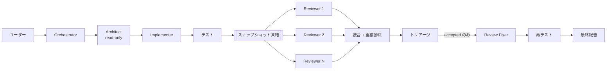

# AI Development Orchestrator

[English](README.md) | **日本語**

**複数のAIコーディングCLI** を組み合わせてソフトウェア開発フロー全体をオーケストレーションする、汎用の
[Agent Skill](https://code.claude.com/docs/en/skills) です。あるモデルで設計し、別のモデルで実装し、
完了とみなす前に複数のモデルが独立してレビューします。

Rails、React、TypeScript、Python、Go など、任意のコードベースで動作します。プロジェクト固有の前提は
一切含みません。

```
リクエスト → 調査/設計 → 実装 → テスト
           → 独立レビュー → トリアージ → 修正 → 再テスト → 最終報告
```

全工程が必須ではありません。オーケストレーターがリクエストを判断し、**必要な工程だけ**を実行します。
typo修正なら編集だけ、スキーマ変更ならフルパイプライン。

---

## なぜ作るのか

単一モデルの開発ループには2つの盲点があります。

**モデルは自分の成果物のレビューが苦手です。** バグを生んだ前提をそのまま共有しているからです。
互いの意見を知らない状態で同じdiffを見た2〜3の**異なる**モデルは、有用な形で食い違います。
その食い違いこそが本物のバグのありかです。

**生のレビュー出力は修正リストではありません。** 複数のレビュアーは互いに重複し、一部はfalse positiveで、
それを全部fixerに丸投げすると無駄な変更が量産されます。そこで findings は機械的に重複統合したうえで、
オーケストレーターが**トリアージ**し、accepted になったものだけが fixer に届きます。

来年も動き続けるために、2つの設計制約を置いています。

- **設定ファイルに日付付きモデルIDを一切書かない。** 設定するのは *family*（`opus`、`fable`、
  `recommended-coding`）と `version: latest` だけで、実際にインストールされているCLIに対して
  provider adapter が実行時に解決します。
- **モデル名を推測しない。** 検証できないモデルに対して adapter は「それらしい文字列」をCLIに渡さず、
  エラーで停止します。

## AIオーケストラ: 誰が何を担当するか

`dev-orchestra` は「1つのAIにコードを書かせる」ものではありません。工程ごとに
別のモデルを割り当て、そのうち2つには**意図的に意見を食い違わせます**。

1. **指揮** — 依頼を読み、必要な工程を判断し、タスクを分解して結果を統合します。
   大量の入力（ログ、レガシーコード、長い仕様書）を消化するのもこの工程です。
2. **設計** — コードベースを調査して計画を書きます。読み取り専用。
3. **実装** — その計画からコードとテストを書きます。
4. **レビュー** — 凍結した差分を読み、findings を報告します。読み取り専用。
5. **独立レビュー** — 同じ差分を、別ベンダーのモデルが、1人目の意見を知らないまま
   レビューします。
6. **トリアージ・修正・再テスト** — findings を重複排除し、オーケストレータが採否を
   判断し、accepted のものだけが修正担当に渡ります。

現時点の両CLIが提供しているモデルに当てはめた構成例:

| 工程 | 設定上のロール | CLI | family |
| --- | --- | --- | --- |
| 指揮・大量入力の処理 | `orchestrator` | Codex | `gpt-5.6-sol` |
| 設計 | `architect` | Claude Code | `fable` |
| 実装 | `implementer` | Claude Code | `opus` |
| レビュー | reviewer | Claude Code | `opus` |
| 独立レビュー | reviewer | Codex | `gpt-5.6-terra` |
| accepted findings の修正 | `review_fixer` | Claude Code | `opus` |

設定ファイルにすると次のようになります。

```yaml
version: 1

orchestrator:
  provider: codex
  model:
    family: gpt-5.6-sol
    version: latest

architect:
  provider: claude
  model:
    family: fable
    version: latest

implementer:
  provider: claude
  model:
    family: opus
    version: latest

review_fixer:
  provider: claude
  model:
    family: opus
    version: latest

reviewers:
  - id: claude-review
    provider: claude
    model:
      family: opus
      version: latest
    role: general
  - id: codex-independent
    provider: codex
    model:
      family: gpt-5.6-terra
      version: latest
    role: general
```

**コピーする前に、自分の環境で family を確認してください。** モデル名は変わりますし、
CLIのバージョンやアカウントによって提供されるモデルも異なります。

```bash
dev-orchestra model list
```

ここに表示されたものを使ってください。各アダプタは、インストール済みCLIが認めない
family を推測せずに拒否します。古い名前は実行時に黙って別モデルを使うのではなく、
セットアップ時にはっきり失敗します。

重要なのはこの表そのものではなく、**設計と独立レビューを別ベンダーに割り当てる**という
形です。同じ系列のモデル同士は、バグを生んだ思い込みまで共有してしまいます。

## 必要なもの

- **Python 3.9以上** — 標準ライブラリのみ。pip install 不要。
  （PyYAML があれば使いますが、設定形式は内蔵パーサでカバーしています。）
- **git** — レビュースナップショットに必要です。
- **サポート対象CLIのいずれか**（認証済みであること）:
  - [Claude Code](https://claude.com/claude-code) (`claude`)
  - [Codex CLI](https://developers.openai.com/codex/cli) (`codex`)

このSkillは**既存のCLIログインをそのまま使います**。APIキーを要求せず、認証情報を保存せず、出力もしません。

## インストール

**Plugin として入れる**（Claude Code と Codex が同じパッケージを読みます）か、
従来どおり **チェックアウトを Skill として入れる** かを選べます。どちらも
サポート対象ですが、Plugin のほうが手順が短く、その場で更新できます。

配布はこのリポジトリからのみです。Anthropic / OpenAI の公式Marketplaceには
公開していません。

### Claude Code Plugin

Claude Code 内から:

```
/plugin marketplace add istb16/dev-orchestra
/plugin install dev-orchestra@dev-orchestra
```

シェルから:

```bash
claude plugin marketplace add istb16/dev-orchestra
claude plugin install dev-orchestra@dev-orchestra
```

Skill は次のセッションから使えます。`/plugin marketplace update` で更新、
`claude plugin uninstall dev-orchestra` で削除します。

### Codex Plugin

```bash
codex plugin marketplace add istb16/dev-orchestra
codex plugin add dev-orchestra@dev-orchestra
```

`codex plugin marketplace upgrade` でスナップショットを取り直し（反映するには
`codex plugin add` を再実行）、`codex plugin list` で状態を確認、
`codex plugin remove dev-orchestra@dev-orchestra` で削除します。
Codex も次のセッションから同梱Skillを認識します。

どちらのホストも Plugin を自分のキャッシュ（`~/.claude/plugins/cache/…`、
`~/.codex/plugins/cache/…`）にコピーして、そこから実行します。Skillが使う
`scripts/`・`references/`・`bin/` はすべてそのコピーに含まれるので、
チェックアウト先を指すパスは残りません。

### ローカルでのPlugin開発

GitHubではなくクローンを直接指定します。

```bash
git clone https://github.com/istb16/dev-orchestra.git
cd dev-orchestra

claude plugin validate .                    # manifest検証、CIでは --strict
claude plugin marketplace add "$PWD"
claude plugin install dev-orchestra@dev-orchestra

codex plugin marketplace add "$PWD"
codex plugin add dev-orchestra@dev-orchestra
```

実際に読み込まれた内容は `claude plugin details dev-orchestra` で確認できます。
manifestを編集したら `python scripts/validate_skill.py` を再実行してください。
両ホストのmanifestと同梱Skillの整合をチェックします。

### 従来方式: チェックアウトをSkillとして導入

Plugin以前のインストーラも従来どおり使えます（変更なし）。

```bash
git clone https://github.com/istb16/dev-orchestra.git
cd dev-orchestra
```

#### Claude Code の場合

```bash
./install/install.sh              # ~/.claude/skills/ にシンボリックリンク
```

```powershell
.\install\install.ps1             # Windows
```

インストーラはこのリポジトリをスキルディレクトリにリンク（`--copy` でコピー）するので、`git pull`
だけでその場でアップグレードされます。`--project <path>` で特定リポジトリの `.claude/skills/` にだけ
入れることもできます。その場合、対象リポジトリの `.git/info/exclude` にもパスを追記するので、
**相手のリポジトリの `git status` を汚しません**（これがないと `git add -A` が
"does not have a commit checked out" で失敗します）。

Windows では Git Bash から `install.sh` を実行せず、`install.ps1` を使ってください。Git Bash は
MSYS形式のパス（`/c/...`）を書き込みますが、ネイティブPythonはそれを開けません。シンボリックリンクには
開発者モードか管理者権限が必要で、作れない場合はインストーラが自動でコピーにフォールバックします。

#### Codex CLI の場合

Pluginを使わない場合、インストーラは `AGENTS.md` にマーカー付きの短いポインタブロックを
追記します。

```bash
./install/install.sh --codex                    # ~/.codex/AGENTS.md
./install/install.sh --codex --project /path    # <project>/AGENTS.md
```

`skills/dev-orchestra/SKILL.md` が単一の情報源であり続けます。ポインタは参照するだけで、内容を複製しません。

#### 任意: CLIをPATHに通す

```bash
export PATH="$PWD/bin:$PATH"      # どこからでも `dev-orchestra doctor` が使えます
```

#### 動作確認

```bash
./bin/dev-orchestra doctor
```

## 初期セットアップ

初回実行時、設定が無いことを検知してウィザードが起動します。

```
AI Development Orchestrator setup

Detected CLIs:
  claude:  installed
  codex:   installed

1. Orchestrator
   CLI:
     1) Claude Code (2.1.x) (recommended)
     2) Codex CLI (0.154.x)
   Model:
     1) sonnet [cli-help] (recommended)
     2) opus [cli-help]
     3) fable [cli-help]
     4) custom (type a family or exact model id)
...
5. External Reviewers
   How many reviewers? [2]
   reviewer #1  CLI / Model / Review role / id
   reviewer #2  CLI / Model / Review role / id
   Add another reviewer? [y/N]

Configuration
  Orchestrator    claude / sonnet / latest
  Architect       claude / fable  / latest
  Implementer     claude / opus   / latest
  Review Fixer    claude / opus   / latest
  Reviews
    1. claude / opus / latest / general / claude-general
    2. codex / recommended-coding / latest / general / codex-general

Save configuration? [Y/n]
```

対話なしで推奨値を書き込む場合:

```bash
dev-orchestra config setup --defaults
```

## 使い方

普段どおり自然言語でエージェントに話しかけてください。次のようなリクエストで起動します。

- 「この issue を設定済みのワークフローで実装して」
- 「チェックアウトのタイムアウトを調査して直して」
- 「今の変更を全レビュアーでレビューして」
- 「このブランチを main と比較してマルチモデルレビューして」
- 「Codex の security reviewer を追加して」
- 「実装は最新の Claude Opus を使って」

配管部分は直接叩くこともできます。

```bash
dev-orchestra doctor
dev-orchestra review snapshot --base main
dev-orchestra review run
dev-orchestra review show
dev-orchestra review triage F1 --status accepted --note "確認済み"
dev-orchestra review fix-brief --output fix-brief.md
```

全コマンドは `references/cli.md`（英語）を参照してください。

## 実際のワークフロー

工程ごとに手で叩く必要はありません。1文で依頼すれば、必要な工程だけが実行されます。
以下のコマンドは、その裏でオーケストレータが実行しているものです。1工程だけを自分で
回したいときに使ってください。

**1. 指揮.** オーケストレータが依頼を分類し、各工程の前に残り予算を確認します。

```bash
dev-orchestra status
```

**2. 設計.** architect が調査して計画を書きます。ファイルは編集できません（読み取り専用）。

```bash
dev-orchestra run architect --prompt-file .ai/request.md --output .ai/plan.md
```

**3. 実装.** implementer は元の依頼ではなく、その計画から実装します。

```bash
dev-orchestra run implementer --prompt-file .ai/plan.md
```

**4. レビュー.** まず差分を凍結し、全レビュアーがバイト単位で同一の入力を見ます。
その上で、並列・独立・読み取り専用で実行されます。

```bash
dev-orchestra review snapshot --base main
dev-orchestra review run
dev-orchestra review show
```

**5. トリアージ.** 重複排除は機械的に行いますが、どれが本物かの判断はオーケストレータが
担当します。

```bash
dev-orchestra review triage F1 F3 --status accepted --note "confirmed"
dev-orchestra review triage F2 --status rejected --note "guarded by the caller"
```

**6. 修正と再テスト.** 修正担当に渡るのは accepted の findings だけです。

```bash
dev-orchestra review fix-brief --output .ai/fix-brief.md
dev-orchestra run review_fixer --prompt-file .ai/fix-brief.md
```

その後テストを再実行し、`dev-orchestra review status` がもう1周する価値があるか、
ループを終えるべきかを判断します。

## 大量のテキストを扱う場合

ログ、レガシーモジュール、長い仕様書などは、そのために設定したモデルにまとめて渡し、
**結論だけ**を残して設計・レビュー工程へ引き継ぎます。40MBのログに使ったコンテキストは、
そのぶんレビュアーが差分に使えなくなるコンテキストです。

解析依頼はファイルに書き（中身を貼り付けるのではなく、リポジトリ内のパスを指し示す）、
大量入力担当に割り当てたロールで実行します。

```bash
dev-orchestra run orchestrator \
  --prompt-file .ai/analysis-request.md \
  --output .ai/analysis.md
```

依頼文の例:

> `log/production-2026-09-08.log` と `app/services/checkout/*.rb` を読んで、
> 失敗パターンの種類、それぞれの発生頻度、関係するコードパスを列挙してください。
> 修正はまだ不要です。findings のみを、`file:line` 付きでグループ化して出力してください。

そして、ログではなく**その要約から**設計します。

```bash
dev-orchestra run architect --prompt-file .ai/analysis.md --output .ai/plan.md
dev-orchestra run implementer --prompt-file .ai/plan.md
dev-orchestra review snapshot --base main
dev-orchestra review run
```

仕様書レビューや依存関係の棚卸しでも同じ分担が使えます。1つのモデルが情報を消化し、
別のモデルが設計し、さらに2つが結果について意見を戦わせます。

## 実行コストの確認

委譲した実行ごとに消費量を記録するので、「トークンがどこで消えたか」は推測せずに答えられる。

```bash
dev-orchestra tokens show
```

```
  stage              meas.     input    output     total    billed      cost
  architect            1/1     8,200     2,100         -    11,500   $0.0421
  implementer          1/1    21,300     8,400         -    31,900   $0.2140
  review               4/4    58,000     6,400         -    64,400   $0.3900
  ALL                  6/6    87,500    16,900         -   107,800   $0.6461

Per reviewer:
  claude-general       2/2    29,100     3,300         -    32,400   $0.1950
  codex-general        2/2    28,900     3,100         -    32,000   $0.1950
```

合計は `status` と `summary` にも出る。読むときの前提が3つある。

- **数字はCLI側の報告で、こちらの推定ではない。** Claude Code は input / output /
  キャッシュ読み / キャッシュ書き込みと価格を返す。Codex は合計値のみ。推定は一切
  しない: 送ったプロンプトから見積もっても、子CLI自身のシステムプロンプト・ツール
  スキーマ・CLIが自分で読んだファイル — 入力の大部分 — が抜け落ちる。`meas.` は
  そのステージのうち何回が実際に報告したかで、報告のない実行があれば「合計は下限
  (floor) である」と明示する。
- **`billed` にキャッシュ読みは含めない。** 価格が新規入力の約1/10なので、含めると
  キャッシュが効いたステージが高コストなステージより上に来てしまう。金額は `cost`
  を見る。
- **レビュアーは1人ずつ計上する。** レビューはパイプライン中で最も重複するコスト
  (同じ diff を、レビュアーごとに、ラウンドごとに) だからで、3人目のレビュアーが
  元を取れているかはこの行でしか判断できない。

これは計測であって予算ではない。コストを理由に実行を拒否することはしない。拒否する
のは `budget` の試行回数予算の役目で、どちらか一方を他方と読み違えないようコマンドを
分けている。

## 設定

優先順位: **プロジェクト → グローバル → 内蔵デフォルト**。

| レイヤ | パス |
| --- | --- |
| プロジェクト | `<repo>/.dev-orchestra.yaml` |
| グローバル (Linux/macOS) | `~/.config/dev-orchestra/config.yaml` |
| グローバル (Windows) | `%APPDATA%\dev-orchestra\config.yaml` |

```yaml
version: 1

orchestrator:
  provider: claude
  model:
    family: sonnet
    version: latest

architect:
  provider: claude
  model:
    family: fable
    version: latest

implementer:
  provider: claude
  model:
    family: opus
    version: latest

review_fixer:
  provider: claude
  model:
    family: opus
    version: latest

reviewers:
  - id: claude-general
    provider: claude
    model:
      family: opus
      version: latest
    role: general
  - id: codex-general
    provider: codex
    model:
      family: recommended-coding
      version: latest
    role: general

review:
  max_review_iterations: 2
  parallel: true
```

```bash
dev-orchestra config show
dev-orchestra config set implementer.model.family sonnet
dev-orchestra config set --scope project architect.provider codex
dev-orchestra config reset
```

マッピングはキー単位でマージされますが、**リストは丸ごと置き換わります**。プロジェクト設定で
`reviewers` を定義すると、そのリポジトリのレビュー体制を完全に上書きできます。

スキーマ全体は `references/configuration.md`（英語）にあります。

## モデル選択

設定に保存するのは **family と方針** だけで、スナップショットは保存しません。

```yaml
implementer:            # tracks the latest Opus, whatever that is today
  model:
    family: opus
    version: latest

architect:              # frozen to one snapshot - only do this deliberately
  model:
    family: opus
    version: pinned
    id: claude-opus-5

review_fixer:           # let the CLI pick entirely
  model:
    family: default
    version: latest
```

解決の優先順位:

1. インストール済みCLIが提示する情報 — Claude は `claude --help` の alias、Codex は
   `codex debug models` のカタログと `$CODEX_HOME/config.toml` のデフォルト
2. provider の現行 alias
3. **family のみ**を並べた内蔵フォールバック（最終確認日付き）

どれでも検証できない場合、理由を示して停止します。推測は行いません。

```bash
dev-orchestra model list
```

```
claude: installed
  fable    family=fable    source=cli-help
  opus     family=opus     source=cli-help
  sonnet   family=sonnet   source=cli-help
codex: installed
  CLI default (recommended coding model)  family=recommended-coding  source=cli-default
  gpt-6-astra (this CLI's configured model) family=gpt-6-astra       source=cli-config
  GPT-5.6-Terra                           family=gpt-5.6-terra       source=cli-catalog
```

`recommended-coding` は **`-m` を付けない**ことで解決します。CLI自身の現行デフォルトが、
定義上いちばん新しいからです。それ以外の family は、この一覧に出てくるものに限られます。
Codexアダプタが受け付けるのは、CLIが設定しているモデルと、CLI自身のカタログが公開している
slug だけで、それ以外は拒否します。

## レビュアー

0個以上（2個以上を推奨）。それぞれが独立・read-only で、同一の凍結済みdiffをレビューします。

```bash
dev-orchestra reviewer list
dev-orchestra reviewer add --provider codex --role security
dev-orchestra reviewer add --provider claude --role database
dev-orchestra reviewer set 2 --role performance
dev-orchestra reviewer remove codex-security
```

組み込みロール: `general`、`security`、`performance`、`test`、`architecture`、`database`、
`frontend`、`backend`。任意のカスタムロールも指定できます。

全レビュアーの findings はパースされ、重複統合され、深刻度順に並べられ、修正前に必ずトリアージされます。

重複判定は意図的に2段構えです。自動統合はほぼ同一の言い換えだけを潰します。異なるバグを1つに
まとめてしまうと片方が消えるからです。**跨モデルの重複は散文がまったく似ません** — 実際の2社
レビュー出力で測ったところ、真の重複ペアのテキスト類似度が 0.03、無関係なペアが 0.29 でした。
そこで、異なるレビュアーが**同じコードを引用している** findings を「重複候補」として提示し、
Orchestrator がトリアージ時に確定させます。詳細は `references/reviews.md`（英語）。

各ロールには provider 固有の `options` も指定できます（Claude は `permission_mode`、Codex は
`sandbox` / `approve`）。値はインストール済みCLIが実際に受け付けるものと照合されます。read-only
工程を緩めようとする option は無視され、`doctor` がそれを報告します。architect と全レビュアーは
設定に関わらず read-only を維持します。

## ワークフロー例

**既存Railsアプリケーションへの機能追加**

> 「チェックアウトに顧客ごとの上限金額を追加して」

```
Codex gpt-5.6-sol      既存のチェックアウト実装と直近のログを読み、
                       依頼を工程に分解
        |
Claude fable           設計: 上限をどこに持たせるか、影響範囲、マイグレーション
        |
Claude opus            実装とテストの作成
        |
Claude opus            凍結された差分をレビュー
Codex gpt-5.6-terra    同じ差分を独立にレビュー
        |
Codex gpt-5.6-sol      両方の結果を統合し、重複を落とし、トリアージ
        |
Claude opus            accepted の findings だけを修正
        |
                       テスト再実行、報告
```

利用者側の操作はエージェントへの1文だけです。成果物は `.ai/` に残ります（計画、
各レビュー、統合済み findings、トリアージ結果）。

**API変更を伴う機能追加**

> 「orders エンドポイントにページネーションを追加して」

設計 (Fable) → 実装 (Opus) → テスト → 独立レビュー2件 → トリアージ（2件accepted、1件rejected）
→ 修正 (Opus) → 再テスト → 報告。

**typo修正**

> 「README の見出しの typo を直して」

編集1回のみ。設計もレビューもしません。省略したことは報告に明記されます。

**レビューのみ**

> 「このブランチの main 以降の変更を全レビュアーでレビューして」

```bash
dev-orchestra review snapshot --base main
dev-orchestra review run
dev-orchestra review show
```

**低コストな動作確認** — レビュアーをオフラインの mock provider に差し替えます。

```bash
dev-orchestra reviewer add --provider mock --id dry --role general
DEV_ORCHESTRA_MOCK_RESPONSE=NO_FINDINGS dev-orchestra review run --only dry
```

## トラブルシューティング

| 症状 | 原因と対処 |
| --- | --- |
| `Source: built-in defaults` | 設定ファイルが未作成。`dev-orchestra config setup`。 |
| `codex: … does not vouch for …` | この Codex CLI が提供していない family。`dev-orchestra model list` で確認し、`recommended-coding` を使うか、正確なIDをpinする。 |
| `claude: cannot resolve model family 'x'` | 提示されていない alias。`dev-orchestra model list` で確認。 |
| `Installed: no` | CLIがPATHにない。自分でインストールしてください（Skillは勝手に入れません）。 |
| 委譲先CLIの `Failed to authenticate` | そのCLIで直接ログイン（`claude`、`codex login`）。`doctor` は認証情報の**存在**のみを見ており、有効性は検証しません。 |
| `review snapshot` が empty | `HEAD` との差分がない。`--base <rev>` を使うか、実装工程が動いたか確認。 |
| `not a git repository` | スナップショットにはgitが必要。`git init` するか、コミット済みリポジトリで実行。 |
| レビュアーが1件失敗 | 想定内で継続します。理由は `.ai/reviews/consolidated.md` に記録されます。 |
| Implementerがテストを実行できない | `acceptEdits` は編集のみ自動承認し、シェルコマンドは承認しません。プロジェクト側のCLI設定でコマンドを許可リストに入れるか、`implementer.options.permission_mode` を設定してください。 |
| 明らかに同じ findings が2件ある | 自動統合は意図的に保守的です。「Possible duplicates」の一覧を確認し、片方を `duplicate` としてトリアージしてください。 |
| レビューが終わらない | `review.timeout_seconds` を下げるか、`--sequential` でどのレビュアーが止まっているか特定。 |
| 設定のパースエラー | 内蔵YAMLパーサは anchor、alias、ブロックスカラーを拒否します。簡素化するか PyYAML を入れてください。 |

`dev-orchestra doctor --json` で同じ情報を機械可読な形で取得できます。

## セキュリティ

- **認証情報を要求も保存も出力もしません。** 環境を継承し、CLI側の既存認証に依存します。
- `doctor` が報告するのは認証情報の**存在**（`present` / `unknown`）だけで、値ではありません。
- 取得した stdout/stderr は、`.ai/` や画面に出る前に認証情報らしき文字列を除去するredactorを通ります。
- レビュアーは read-only で動作します（Claude は `--permission-mode plan` + 編集ツール禁止、
  Codex は `-s read-only`）。
- 成果物は `.ai/` に隔離され、既定で自分自身をgit管理外にします。
- Skill自身はネットワークにアクセスしません。通信するのはCLIです。

セキュリティ上の問題を見つけた場合は `CONTRIBUTING.md` を参照してください（公開issueは立てないでください）。

## 対応プラットフォーム

| プラットフォーム | 状態 |
| --- | --- |
| Linux | 対応・CI検証済み |
| macOS | 対応・CI検証済み |
| Windows（ネイティブ / PowerShell） | 対応・CI検証済み。`bin\dev-orchestra.ps1` を使用。 |
| Windows（WSL） | 対応 — Linuxとして扱ってください |

WSLは**必須ではありません**。中身は純粋なPythonと`git`だけで、シェルラッパーは利便性のためのものです。

## アップグレード

Claude Code は marketplace の更新と新バージョンの導入を1コマンドで行います。

```bash
/plugin marketplace update
```

Codex は2段階です。`marketplace upgrade` はGitスナップショットを取り直すだけで、
インストール済みのコピーは `add` し直すまでキャッシュ内の古いバージョンのままです。

```bash
codex plugin marketplace upgrade
codex plugin add dev-orchestra@dev-orchestra
```

チェックアウト導入の場合:

```bash
cd /path/to/dev-orchestra
git pull
./bin/dev-orchestra doctor
```

シンボリックリンク導入なら即座に反映されます。`--copy` の場合はインストーラを再実行してください。
設定はメジャーバージョン内で前方互換です。対応が必要な変更は `CHANGELOG.md` に明記します。

## アンインストール

```bash
claude plugin uninstall dev-orchestra      # Plugin導入の場合
codex plugin remove dev-orchestra@dev-orchestra
```

```bash
./install/uninstall.sh            # スキルのリンクと AGENTS.md のブロックを削除
```

```powershell
.\install\uninstall.ps1
```

設定は残ります。設定も消す場合:

```bash
dev-orchestra config reset --scope global --delete
rm -rf .ai                        # 成果物も消す場合、プロジェクトごとに
```

## バージョニングと変更履歴

[セマンティックバージョニング](https://semver.org/lang/ja/)に従います。公開APIとみなすのは、
設定スキーマ、CLIのコマンドとフラグ、`.ai/` の成果物フォーマットです。

- **major** — 設定スキーマまたはCLIの破壊的変更
- **minor** — コマンド、provider、ロール、フィールドの追加
- **patch** — 修正とドキュメント

変更は `CHANGELOG.md` の `Unreleased` に追記し、リリース時に確定させます
（[Keep a Changelog](https://keepachangelog.com/ja/1.1.0/)）。

## アーキテクチャ



| 要素 | 場所 | 役割 |
| --- | --- | --- |
| Skill | `skills/dev-orchestra/SKILL.md` | 何をいつ実行するか、何をしてはいけないか |
| CLI | `scripts/dev_orchestra.py` | エージェントが呼ぶ決定的な操作 |
| Provider | `scripts/orchestrator/providers/` | CLIのフラグとモデル名を知る唯一の場所 |
| References | `references/` | 詳細。必要になったときだけ読む |

詳細版は `references/architecture.md`（英語）にあります。

## コントリビュート

issue と pull request を歓迎します。詳細は `CONTRIBUTING.md`（英語）を参照してください。
とくに、**CLIがフラグやモデル名を変更したときの adapter 修正**が最も価値の高い貢献です。

```bash
python -m unittest discover -s tests -t tests
python scripts/validate_skill.py
```

## ドキュメントの言語方針

`skills/dev-orchestra/SKILL.md` と `references/` は英語のみです。これはAIモデルが読むファイルであり、英語のほうが
トリガ精度とトークン効率の面で有利なためです。人間向けの入口である README は日英両方を用意しています。

## ライセンス

MIT — `LICENSE` を参照してください。
