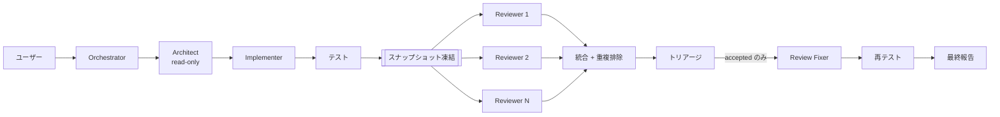

# AI Development Orchestrator

[English](README.md) | **日本語**

**複数のAIコーディングCLI** を組み合わせてソフトウェア開発フロー全体をオーケストレーションする、汎用の
[Agent Skill](https://code.claude.com/docs/en/skills) です。あるモデルで設計し、別のモデルで実装し、
完了とみなす前に複数のモデルが独立してレビューします。どんなコードベースでも動き、リクエストに必要な
工程だけを実行します。typo修正なら編集だけ、スキーマ変更ならフルパイプラインです。

## なぜ作るのか

**モデルは自分の成果物のレビューが苦手です。** バグを生んだ前提をそのまま共有しているからです。
互いの意見を知らない状態で同じdiffを見た2〜3の**異なる**モデルは、有用な形で食い違います。
その食い違いこそが本物のバグのありかです。

**生のレビュー出力は修正リストではありません。** 複数のレビュアーは互いに重複し、一部はfalse positiveで、
それを全部fixerに丸投げすると無駄な変更が量産されます。そこで findings は機械的に重複統合したうえで、
オーケストレーターが**トリアージ**し、accepted になったものだけが fixer に届きます。そしてモデル名は
決して推測しません。設定に書くのは *family* と `version: latest` で、検証できなければ adapter は
エラーで停止します。

## 誰が何を担当するか

| 工程 | 設定上のロール | 役割 |
| --- | --- | --- |
| 指揮 | `orchestrator` | 依頼に必要な工程を判断し、大量の入力を消化し、結果を統合する |
| 設計 | `architect` | 調査して計画を書く（読み取り専用）。承認するまで実装には進まない |
| 実装 | `implementer` | 計画からコードとテストを書く |
| レビュー | reviewers | 2つ以上のモデルが同じ凍結済みの差分を、読み取り専用で、互いを見ずに読む |
| 修正 | `review_fixer` | オーケストレーターが accepted にした findings だけを直す |


```mermaid
flowchart LR
    U[ユーザー] --> O[Orchestrator]
    O --> A[Architect<br/>read-only]
    A --> I[Implementer]
    I --> T[テスト]
    T --> S[[スナップショット凍結]]
    S --> R1[Reviewer 1]
    S --> R2[Reviewer 2]
    S --> R3[Reviewer N]
    R1 --> C[統合 + 重複排除]
    R2 --> C
    R3 --> C
    C --> TR[トリアージ]
    TR -->|accepted のみ| F[Review Fixer]
    F --> T2[再テスト] --> REP[最終報告]
```

重要なのは **設計と独立レビューを別ベンダーに割り当てる** という形です。同じ系列のモデル同士は、
バグを生んだ思い込みまで共有してしまいます。

## 必要なもの

- **Python 3.11以上** — 標準ライブラリのみ（PyYAML があれば使います）。`python3` という名前しか
  ない環境では `python3` で、または自動で選ぶ `bin/dev-orchestra[.ps1]` で実行してください。
- **git** — レビュースナップショットに必要です。
- **サポート対象CLIのいずれか**（認証済みであること）:
  - [Claude Code](https://claude.com/claude-code) (`claude`)
  - [Codex CLI](https://developers.openai.com/codex/cli) (`codex`)

Skill は Claude Code、Codex、Antigravity のいずれかの Plugin として動きます。上の CLI は
Skill が動かす相手で、Skill が動く場所ではありません。

このSkillは**既存のCLIログインをそのまま使います**。APIキーを要求せず、認証情報を保存せず、出力もしません。

## インストール

このリポジトリから Plugin として入れます（公式Marketplaceには公開していません）。Claude Code と
Codex は自分のキャッシュ（`~/.claude/plugins/cache/…`、`~/.codex/plugins/cache/…`）にある
コピーを実行し、次のセッションから使えます。Antigravity は自分の `plugins/` フォルダに置かれた
ディレクトリを読み込みます。

### Claude Code Plugin

```bash
claude plugin marketplace add istb16/dev-orchestra
claude plugin install dev-orchestra@dev-orchestra
```

Claude Code の中からは `/plugin marketplace add istb16/dev-orchestra`、続けて
`/plugin install dev-orchestra@dev-orchestra` です。

### Codex Plugin

```bash
codex plugin marketplace add istb16/dev-orchestra
codex plugin add dev-orchestra@dev-orchestra
```

`codex plugin list` で導入済みのものを確認できます。

### Antigravity Plugin

リポジトリをクローンし、Antigravity の plugins フォルダにリンクします。

```bash
git clone https://github.com/istb16/dev-orchestra.git
cd dev-orchestra
./install/install.sh --antigravity    # links into ~/.gemini/config/plugins/
```

```powershell
.\install\install.ps1 -Antigravity    # Windows
```

手でやる場合はリンク1つです: `ln -s "$PWD" ~/.gemini/config/plugins/dev-orchestra`。
`--project <path>` を付けると `<path>/.agents/plugins/` に入れます。入れたあとは Antigravity を
再起動してください。新しい Plugin のディレクトリは起動時にしか見つけられません。リンクで入れた
場合はチェックアウトで今のブランチがそのまま読み込まれるので、信頼できないブランチを見るときは
`--copy` か別の worktree を使ってください。

Plugin 以前のインストーラも使えます
（[Skill のチェックアウトからのインストール](docs/ja/references/workflow.md#installing-from-a-skill-checkout)）。
クローンから Plugin を動かす方法は `CONTRIBUTING.md`（英語）にあります。

## 初期セットアップ

初回実行時、設定が無いことを検知してウィザードが起動し、`orchestrator`・`architect`・
`implementer`・`review_fixer` の各ロールと各レビュアーについて、CLI とモデルの family を
尋ねます。自分で起動する場合や、質問なしで推奨値を使う場合:

```bash
dev-orchestra config setup
dev-orchestra config setup --defaults
dev-orchestra model list        # the families your installed CLIs offer
```

推奨構成は、architect が Claude の `fable`、実装と修正が Claude の `opus`、レビュアーが Claude と
Codex の1人ずつです。family は `dev-orchestra model list` に表示されたものを使ってください。
ファイルに残るのは自分で決めた値だけです。[ウィザード](docs/ja/references/configuration.md#the-wizard)
と [2社構成の設定例](docs/ja/references/configuration.md#worked-examples) を参照してください。

## 使い方

普段どおりエージェントに話しかけてください。「この issue を設定済みのワークフローで実装して」
「チェックアウトのタイムアウトを調査して直して」「このブランチを main と比較してマルチモデル
レビューして」「Codex の security reviewer を追加して」。1文で依頼すれば、必要な工程だけが
実行されます。1工程だけを自分で回したいときは、オーケストレーターが裏で実行している次の
コマンドを使います（各コマンドの説明は [ワークフロー](docs/ja/references/workflow.md)、[英語版](references/workflow.md)）。

```bash
dev-orchestra run architect --prompt-file .ai/request.md --output .ai/plan.md
dev-orchestra design approve            # after you have read the plan
dev-orchestra run implementer --prompt-file .ai/plan.md
# プロジェクトのテストを走らせ、結果を記録する
dev-orchestra state record test ok
dev-orchestra review snapshot --base main
dev-orchestra review run
dev-orchestra review triage F1 --status accepted --note "confirmed"
dev-orchestra review fix-brief --output .ai/fix-brief.md
dev-orchestra run review_fixer --prompt-file .ai/fix-brief.md
# 同じテストをもう一度走らせ、結果を記録する
dev-orchestra state record test ok
dev-orchestra review status             # 次の回に進むか、報告する
```

ログや長い仕様書は、先にまとめて消化させ、その要約から設計します
（[大量のテキストを渡す](docs/ja/references/limits.md#feeding-it-a-lot-of-text)）。

```bash
dev-orchestra run orchestrator --prompt-file .ai/analysis-request.md --output .ai/analysis.md
```

## 設定

優先順位は **プロジェクト → グローバル → 内蔵デフォルト** です。`<repo>/.dev-orchestra.yaml`、
次に `~/.config/dev-orchestra/config.yaml`（Windows では `%APPDATA%\dev-orchestra\config.yaml`）。
`dev-orchestra config show` で結果を表示し、`config set` で値を1つ変更します。スキーマ、全フィールド、
設定例は [設定](docs/ja/references/configuration.md)（[英語版](references/configuration.md)）にあります。

## モデル選択

ロールには family と `version: latest`（または正確なIDを指定した `pinned`）を保存し、実行のたびに
インストール済みCLIに対して解決します（[モデルの family](docs/ja/references/configuration.md#model-families-and-version-policy)）。
`model_tiers` を使うと、1つのロールに安いモデルやセカンドオピニオン用のモデルを、呼び出し側の指定で
割り当てられます（[モデルの tier](docs/ja/references/configuration.md#model-tiers)）。

## レビュアー

0個以上（2個以上を推奨）。`dev-orchestra reviewer add --provider codex --role security` で追加します。
2巡目は修正だけをレビューし、ロックファイルやバンドルはレビュアーに送りません。ロール、スナップショット、
重複統合、トリアージは [レビュー](docs/ja/references/reviews.md)（[英語版](references/reviews.md)）にあります。

## ワークフロー例

Rails への機能追加、API 変更、typo 修正、レビューのみ、mock provider での試運転:
[ワークフローの例](docs/ja/references/workflow.md#example-workflows)。

## トラブルシューティング

`dev-orchestra doctor` が CLI、設定、モデルの family を確認します。`doctor --json` で同じ内容を
機械可読な形で得られます。症状と対処は [トラブルシューティング](docs/ja/references/cli.md#troubleshooting) にあります。

## セキュリティ

認証情報を要求も保存も出力もしません。architect と全レビュアーは読み取り専用で動き、それはプロンプト
ではなく CLI が強制します。Skill 自身はネットワークにアクセスしません。`--restricted` があなたの
`permissions.deny` に与える影響を含む詳細は [セキュリティ](docs/ja/references/architecture.md#security) にあります。

## 対応プラットフォーム

Linux、macOS、ネイティブの Windows（`bin\dev-orchestra.ps1`）を CI で検証しています。WSL は
Linux として動きますが、必須ではありません。中身は純粋な Python と `git` だけです。Windows での
Antigravity の導入はジャンクションを作るので、開発者モードは要りません。

## アップグレード

```bash
/plugin marketplace update                     # Claude Code, inside a session
codex plugin marketplace upgrade               # Codex: re-fetches the snapshot only,
codex plugin add dev-orchestra@dev-orchestra   # so add it again to install it
```

チェックアウト導入は `git pull` で更新します（[詳細](docs/ja/references/workflow.md#installing-from-a-skill-checkout)）。
Antigravity はチェックアウトで `git pull` し、Antigravity を再起動します。
設定はメジャーバージョン内で前方互換です。対応が必要な変更は `CHANGELOG.md` に明記します。

## アンインストール

```bash
claude plugin uninstall dev-orchestra
codex plugin remove dev-orchestra@dev-orchestra
dev-orchestra config reset --scope global --delete   # optional: your configuration
```

設定は消さない限り残ります。成果物も消す場合は、プロジェクトごとに `.ai/` を削除してください。
チェックアウト導入には `install/uninstall.sh`（Windows は `.ps1`）があります。
Antigravity は `./install/uninstall.sh --antigravity`（Windows は `-Antigravity`）のあと、再起動します。

## バージョニングと変更履歴

[セマンティックバージョニング](https://semver.org/lang/ja/)に従い、設定スキーマ、CLIのコマンドとフラグ、
`.ai/` の成果物フォーマットを公開APIとみなします。破壊的変更は major、コマンド・provider・ロール・
フィールドの追加は minor、修正とドキュメントは patch です。`CHANGELOG.md` は
[Keep a Changelog](https://keepachangelog.com/ja/1.1.0/) に従います。

## アーキテクチャ

判断はモデルに、手順はコードに置きます。`skills/dev-orchestra/SKILL.md` が何を実行するかを決め、
`scripts/dev_orchestra.py` が決定的な処理を行い、CLIのフラグとモデル名を知っているのは provider だけです。
自前の adapter は `<設定ディレクトリ>/providers/` に置けます（[providers](docs/ja/references/providers.md)）。
詳細版は [アーキテクチャ](docs/ja/references/architecture.md) にあります。

## リファレンス

この README の詳細です。英語版はオーケストレーターのモデルも読むドキュメントで、こちらが正です。日本語版は人が読むための訳です。

| 日本語版 | 英語版 | 答えている問い |
| --- | --- | --- |
| [workflow.md](docs/ja/references/workflow.md) | [references/workflow.md](references/workflow.md) | 各工程で何をするか、プロンプトのテンプレート、`.ai/` の成果物、ワークフローの例、チェックアウトからの導入 |
| [configuration.md](docs/ja/references/configuration.md) | [references/configuration.md](references/configuration.md) | スキーマ、階層、全フィールド、モデルの family と tier、ウィザード、設定例 |
| [providers.md](docs/ja/references/providers.md) | [references/providers.md](references/providers.md) | adapter のインターフェース、Claude と Codex、CLI の追加方法 |
| [reviews.md](docs/ja/references/reviews.md) | [references/reviews.md](references/reviews.md) | スナップショット、送らないファイル、修正だけを見る2巡目、出力の形式、重複統合、トリアージ |
| [architecture.md](docs/ja/references/architecture.md) | [references/architecture.md](references/architecture.md) | 構成要素のつながり、その理由、セキュリティ |
| [limits.md](docs/ja/references/limits.md) | [references/limits.md](references/limits.md) | stall、タイムアウト、予算、大量の入力、実行コスト、最適化レベル |
| [cli.md](docs/ja/references/cli.md) | [references/cli.md](references/cli.md) | 全コマンドとフラグ、トラブルシューティング |

## コントリビュート

issue と pull request を歓迎します。詳細は `CONTRIBUTING.md`（英語）を参照してください。セキュリティ上の
問題の報告方法もそこにあります（公開issueは立てないでください）。とくに、**CLIがフラグやモデル名を
変更したときの adapter 修正**が最も価値の高い貢献です。

## ドキュメントの言語方針

Skill と `references/` は、AIモデルが最もよく読める英語で書きます。README は [English](README.md) と
[日本語](README.ja.md) の両方があります。`docs/ja/references/` の訳は人が読むためのもので、英語版が正です。
各訳は訳した英語版の sha256 を記しており、英語版が変わって訳が追いついていないとテストが失敗します。

## ライセンス

MIT — `LICENSE` を参照してください。
