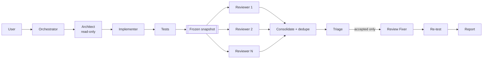

# AI Development Orchestrator

**English** | [日本語](README.ja.md)

A general-purpose [Agent Skill](https://code.claude.com/docs/en/skills) that
orchestrates a full software-development workflow across **multiple AI coding
CLIs** — design with one model, implement with another, then have several
models review the result independently before anything is called done.

Works with any codebase: Rails, React, TypeScript, Python, Go, anything else.
Nothing in the skill is project-specific.

```
Request → Investigation/Design → Implementation → Test
        → Independent Reviews → Triage → Fix → Re-test → Report
```

Stages are **not** all mandatory. The orchestrator judges each request and runs
only the stages it needs — a typo fix skips straight to the edit; a schema
change gets the full pipeline.

---

## Why this exists

Single-model development loops have two blind spots.

**A model reviewing its own work is a weak reviewer.** It shares the
assumptions that produced the bug. Two or three *different* models, each seeing
the same diff with no knowledge of the others' opinions, disagree in useful
ways — and the disagreements are where the real bugs are.

**Raw review output is not a fix list.** Multiple reviewers duplicate each
other, some findings are false positives, and forwarding all of it to a fixer
produces churn. So findings are deduplicated mechanically and then *triaged* by
the orchestrator; only accepted findings reach the fixer.

Two design constraints follow from wanting this to still work next year:

- **No dated model ids anywhere in configuration.** You configure a *family*
  (`opus`, `fable`, `recommended-coding`) plus `version: latest`, and the
  provider adapter resolves it against the CLI you actually have installed.
- **No guessed model names, ever.** An adapter that cannot verify a model
  raises an error rather than sending a plausible-looking string to a CLI.

## Architecture



| Piece | Where | Job |
| --- | --- | --- |
| Skill | `SKILL.md` | What to run, when, and what not to do |
| CLI | `scripts/dev_orchestra.py` | Deterministic operations the agent calls |
| Providers | `scripts/orchestrator/providers/` | The only code that knows CLI flags and model names |
| References | `references/` | The detail, loaded only when needed |

`references/architecture.md` has the long version.

## Requirements

- **Python 3.9+** — standard library only, no pip install required.
  (PyYAML is used if present, but a built-in parser covers the config format.)
- **git** — required for review snapshots.
- **At least one supported CLI**, already authenticated:
  - [Claude Code](https://claude.com/claude-code) (`claude`)
  - [Codex CLI](https://developers.openai.com/codex/cli) (`codex`)

The skill uses **your existing CLI logins**. It never asks for an API key, never
stores credentials, and never prints them.

## Installation

```bash
git clone https://github.com/istb16/dev-orchestra.git
cd dev-orchestra
```

### Claude Code

```bash
./install/install.sh              # symlinks into ~/.claude/skills/
```

```powershell
.\install\install.ps1             # Windows
```

The installer links (or copies, with `--copy`) this repository into your skills
directory, so `git pull` upgrades the skill in place. Use `--project <path>` to
install into a single repository's `.claude/skills/` instead of globally; that
path is also added to the target repo's `.git/info/exclude`, so the nested
checkout never appears in *their* `git status` and never gets committed.

On Windows, prefer `install.ps1` over running `install.sh` in Git Bash: Git Bash
writes MSYS-style paths (`/c/...`) that native Python cannot open. Symlinks need
Developer Mode or an elevated shell; the installer falls back to a copy on its
own if it cannot link.

### Codex CLI

Codex has no skills directory, so the installer appends a short, marked pointer
block to `AGENTS.md` referencing this checkout:

```bash
./install/install.sh --codex                    # ~/.codex/AGENTS.md
./install/install.sh --codex --project /path    # <project>/AGENTS.md
```

`SKILL.md` stays the single source of truth — the pointer references it rather
than duplicating it.

### Optional: put the CLI on PATH

```bash
export PATH="$PWD/bin:$PATH"      # then `dev-orchestra doctor` works anywhere
```

### Verify

```bash
./bin/dev-orchestra doctor
```

## Initial setup

On first use the skill notices there is no configuration and runs the wizard:

```
AI Development Orchestrator setup

Detected CLIs:
  claude:  installed
  codex:   installed

1. Orchestrator
   CLI:
     1) Claude Code (2.1.x) (recommended)
     2) Codex CLI (0.154.x)
   Model:
     1) sonnet [cli-help] (recommended)
     2) opus [cli-help]
     3) fable [cli-help]
     4) custom (type a family or exact model id)
...
5. External Reviewers
   How many reviewers? [2]
   reviewer #1  CLI / Model / Review role / id
   reviewer #2  CLI / Model / Review role / id
   Add another reviewer? [y/N]

Configuration
  Orchestrator    claude / sonnet / latest
  Architect       claude / fable  / latest
  Implementer     claude / opus   / latest
  Review Fixer    claude / opus   / latest
  Reviews
    1. claude / opus / latest / general / claude-general
    2. codex / recommended-coding / latest / general / codex-general

Save configuration? [Y/n]
```

Non-interactively:

```bash
dev-orchestra config setup --defaults
```

## Usage

Talk to your agent normally. The skill triggers on requests like:

- "Implement this issue using the configured workflow."
- "Investigate and fix the checkout timeout."
- "Review the current changes with all configured reviewers."
- "Run a multi-model review of this branch against main."
- "Add a security reviewer using Codex."
- "Use the latest Claude Opus for implementation."

The plumbing is also usable directly:

```bash
dev-orchestra doctor
dev-orchestra review snapshot --base main
dev-orchestra review run
dev-orchestra review show
dev-orchestra review triage F1 --status accepted --note "confirmed"
dev-orchestra review fix-brief --output fix-brief.md
```

Full command list: `references/cli.md`.

## Configuration

Precedence: **project → global → built-in defaults**.

| Layer | Path |
| --- | --- |
| Project | `<repo>/.dev-orchestra.yaml` |
| Global (Linux/macOS) | `~/.config/dev-orchestra/config.yaml` |
| Global (Windows) | `%APPDATA%\dev-orchestra\config.yaml` |

```yaml
version: 1
orchestrator:  {provider: claude, model: {family: sonnet, version: latest}}
architect:     {provider: claude, model: {family: fable,  version: latest}}
implementer:   {provider: claude, model: {family: opus,   version: latest}}
review_fixer:  {provider: claude, model: {family: opus,   version: latest}}
reviewers:
  - {id: claude-general, provider: claude, model: {family: opus, version: latest}, role: general}
  - {id: codex-general,  provider: codex,  model: {family: recommended-coding, version: latest}, role: general}
review:
  max_review_iterations: 2
  parallel: true
```

(The real files use block style; see `examples/`.)

```bash
dev-orchestra config show
dev-orchestra config set implementer.model.family sonnet
dev-orchestra config set --scope project architect.provider codex
dev-orchestra config reset
```

Full schema: `references/configuration.md`.

## Model selection

Configuration stores **a family and a policy**, never a snapshot:

```yaml
model: {family: opus, version: latest}                        # tracks the latest Opus
model: {family: opus, version: pinned, id: claude-opus-5}     # frozen, deliberately
model: {family: default, version: latest}                     # let the CLI decide
```

Resolution order:

1. What the installed CLI advertises — `claude --help` for aliases,
   `$CODEX_HOME/config.toml` for the Codex default.
2. The provider's current aliases.
3. A built-in fallback list of **families only**, carrying the date it was last
   checked.

If none of those can verify the family, the run stops with an explanation. It
never guesses.

```bash
dev-orchestra model list
```

```
claude: installed
  fable    family=fable    source=cli-help
  opus     family=opus     source=cli-help
  sonnet   family=sonnet   source=cli-help
codex: installed
  CLI default (recommended coding model)  family=recommended-coding  source=cli-default
```

Codex publishes no model list, so `recommended-coding` resolves by *omitting*
the `-m` flag — the CLI's own current default is, by definition, current.

## Reviewers

Zero or more; two or more recommended. Each runs independently, read-only,
against the same frozen diff.

```bash
dev-orchestra reviewer list
dev-orchestra reviewer add --provider codex --role security
dev-orchestra reviewer add --provider claude --role database
dev-orchestra reviewer set 2 --role performance
dev-orchestra reviewer remove codex-security
```

Built-in roles: `general`, `security`, `performance`, `test`, `architecture`,
`database`, `frontend`, `backend`. Custom roles are allowed.

Findings from all reviewers are parsed, deduplicated, severity-ordered, and
triaged before any fix happens.

Deduplication is split in two on purpose. Auto-merge only collapses
near-identical restatements, because collapsing two distinct bugs hides one.
Cross-model duplicates almost never look alike in prose — measured on real
two-provider output, a confirmed duplicate pair scored 0.03 text similarity
while an unrelated pair scored 0.29 — so findings from different reviewers that
quote the same code are listed as **possible duplicates** for the orchestrator
to confirm during triage. Details: `references/reviews.md`.

Each role can also carry provider-specific `options` — notably
`permission_mode` for Claude and `sandbox` / `approve` for Codex — validated
against what the installed CLI actually accepts. Options that would loosen a
read-only stage are ignored and reported by `doctor`: the architect and every
reviewer stay read-only regardless.

## Example workflows

**Feature with an API change**

> "Add pagination to the orders endpoint."

Design (Fable) → Implementation (Opus) → tests → 2 independent reviews →
triage (2 accepted, 1 rejected) → fix (Opus) → re-test → report.

**Typo**

> "Fix the typo in the README heading."

One edit, no design, no review. The orchestrator says so in the report.

**Review only**

> "Review everything on this branch since main with all three reviewers."

```bash
dev-orchestra review snapshot --base main
dev-orchestra review run
dev-orchestra review show
```

**Cheap dry run** — swap a reviewer to the offline mock provider:

```bash
dev-orchestra reviewer add --provider mock --id dry --role general
DEV_ORCHESTRA_MOCK_RESPONSE=NO_FINDINGS dev-orchestra review run --only dry
```

## Troubleshooting

| Symptom | Cause and fix |
| --- | --- |
| `Source: built-in defaults` | No config file yet. `dev-orchestra config setup`. |
| `codex: … cannot be verified` | A family Codex does not publish. Use `recommended-coding`, or pin an exact id. |
| `claude: cannot resolve model family 'x'` | Not an advertised alias. `dev-orchestra model list`. |
| `Installed: no` | The CLI is not on PATH. Install it yourself; the skill will not. |
| `Failed to authenticate` from a delegated CLI | Log in with that CLI directly (`claude`, `codex login`). `doctor` reports credential *presence*, not validity. |
| `review snapshot` says empty | Nothing changed vs `HEAD`. Use `--base <rev>`, or check the implementation ran. |
| `not a git repository` | Snapshots need git. `git init`, or review a committed repo. |
| One reviewer failed | Expected to be survivable. Check `.ai/reviews/consolidated.md` for the reason. |
| The implementer cannot run tests | `acceptEdits` auto-approves edits, not shell commands. Allow-list the command in the project's own CLI settings, or set `implementer.options.permission_mode`. |
| Two findings are obviously the same | Auto-merge is conservative by design. Check the "Possible duplicates" list and triage one as `duplicate`. |
| Reviews never finish | Lower `review.timeout_seconds`, or use `--sequential` to see which reviewer hangs. |
| Config parse error | The built-in YAML parser rejects anchors, aliases and block scalars. Simplify, or install PyYAML. |

`dev-orchestra doctor --json` gives a machine-readable version of all of this.

## Security

- **Credentials are never requested, stored, or printed.** The skill inherits
  your environment and relies on the CLIs' existing authentication.
- `doctor` reports credential *presence* (`present` / `unknown`), never values.
- Captured stdout/stderr passes through a redactor that scrubs
  credential-shaped strings before anything is written to `.ai/` or shown.
- Reviewers run read-only: `--permission-mode plan` + denied edit tools for
  Claude, `-s read-only` for Codex.
- Artifacts stay in `.ai/`, which ignores itself by default.
- No network access of its own; the CLIs do their own networking.

Found a security problem? See `CONTRIBUTING.md`.

## Supported platforms

| Platform | Status |
| --- | --- |
| Linux | Supported, CI-tested |
| macOS | Supported, CI-tested |
| Windows (native, PowerShell) | Supported, CI-tested. Use `bin\dev-orchestra.ps1`. |
| Windows (WSL) | Supported — treat as Linux |

WSL is **not** required. Everything is pure Python plus `git`; the shell
wrappers exist only for convenience.

## Upgrading

```bash
cd /path/to/dev-orchestra
git pull
./bin/dev-orchestra doctor
```

A symlink install picks the new version up immediately; with `--copy`, re-run
the installer. Configuration is forward-compatible within a major version, and
`CHANGELOG.md` calls out anything that needs action.

## Uninstalling

```bash
./install/uninstall.sh            # removes the skill link and the AGENTS.md block
```

```powershell
.\install\uninstall.ps1
```

Your configuration is left alone. To remove it too:

```bash
dev-orchestra config reset --scope global --delete
rm -rf .ai                        # per project, if you want the artifacts gone
```

## Versioning and changelog

[Semantic versioning](https://semver.org/). The public surface is the config
schema, the CLI commands and flags, and the `.ai/` artifact formats.

- **major** — breaking config schema or CLI change
- **minor** — new commands, providers, roles, or fields
- **patch** — fixes and documentation

Changes land in `CHANGELOG.md` under `Unreleased` and are stamped at release
time ([Keep a Changelog](https://keepachangelog.com/)).

## Contributing

Issues and pull requests welcome — see `CONTRIBUTING.md`. In particular: if a
CLI changes its flags or model names, adapter fixes are the most valuable
contribution.

```bash
python -m unittest discover -s tests -t tests
python scripts/validate_skill.py
```

## Documentation language

`SKILL.md` and `references/` are English only: those files are read by AI
models, where English gives better trigger accuracy and token efficiency. The
README, which is the human entry point, is available in
[English](README.md) and [日本語](README.ja.md).

## License

MIT — see `LICENSE`.
