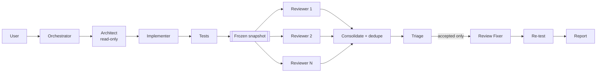

# AI Development Orchestrator

**English** | [日本語](README.ja.md)

A general-purpose [Agent Skill](https://code.claude.com/docs/en/skills) that
orchestrates a full software-development workflow across **multiple AI coding
CLIs** — design with one model, implement with another, then have several
models review the result independently before anything is called done.

Works with any codebase: Rails, React, TypeScript, Python, Go, anything else.
Nothing in the skill is project-specific.

```
Request → Investigation/Design → Implementation → Test
        → Independent Reviews → Triage → Fix → Re-test → Report
```

Stages are **not** all mandatory. The orchestrator judges each request and runs
only the stages it needs — a typo fix skips straight to the edit; a schema
change gets the full pipeline.

---

## Why this exists

Single-model development loops have two blind spots.

**A model reviewing its own work is a weak reviewer.** It shares the
assumptions that produced the bug. Two or three *different* models, each seeing
the same diff with no knowledge of the others' opinions, disagree in useful
ways — and the disagreements are where the real bugs are.

**Raw review output is not a fix list.** Multiple reviewers duplicate each
other, some findings are false positives, and forwarding all of it to a fixer
produces churn. So findings are deduplicated mechanically and then *triaged* by
the orchestrator; only accepted findings reach the fixer.

Two design constraints follow from wanting this to still work next year:

- **No dated model ids anywhere in configuration.** You configure a *family*
  (`opus`, `fable`, `recommended-coding`) plus `version: latest`, and the
  provider adapter resolves it against the CLI you actually have installed.
- **No guessed model names, ever.** An adapter that cannot verify a model
  raises an error rather than sending a plausible-looking string to a CLI.

## The orchestra: who does what

`dev-orchestra` is not "one AI writes the code". Each stage goes to a different
model, and two of them are deliberately allowed to disagree.

1. **Direction** — reads the request, decides which stages it needs, splits the
   work up, and merges the results. This is also the stage that digests bulk
   input (logs, a legacy module, a long spec).
2. **Design** — investigates the codebase and writes the plan. Read-only.
3. **Implementation** — writes the code and the tests from that plan.
4. **Review** — reads the frozen diff and reports findings. Read-only.
5. **Independent review** — the same diff, a different vendor's model, with no
   knowledge of the first reviewer's opinion.
6. **Triage, fix, re-test** — findings are deduplicated, the orchestrator
   accepts or rejects each one, and only accepted findings reach the fixer.

A lineup that maps onto what the two CLIs offer today:

| Stage | Role in the config | CLI | Family |
| --- | --- | --- | --- |
| Direction, bulk input | `orchestrator` | Codex | `gpt-5.6-sol` |
| Design | `architect` | Claude Code | `fable` |
| Implementation | `implementer` | Claude Code | `opus` |
| Review | reviewer | Claude Code | `opus` |
| Independent review | reviewer | Codex | `gpt-5.6-terra` |
| Fixing accepted findings | `review_fixer` | Claude Code | `opus` |

As configuration:

```yaml
version: 1

orchestrator:
  provider: codex
  model:
    family: gpt-5.6-sol
    version: latest

architect:
  provider: claude
  model:
    family: fable
    version: latest

implementer:
  provider: claude
  model:
    family: opus
    version: latest

review_fixer:
  provider: claude
  model:
    family: opus
    version: latest

reviewers:
  - id: claude-review
    provider: claude
    model:
      family: opus
      version: latest
    role: general
  - id: codex-independent
    provider: codex
    model:
      family: gpt-5.6-terra
      version: latest
    role: general
```

**Check those families against your own machine before copying them.** Model
names change, and the two CLIs offer different ones per version and account:

```bash
dev-orchestra model list
```

Use what it prints. Every adapter refuses a family the installed CLI does not
vouch for instead of guessing, so a stale name fails loudly during setup rather
than quietly running something else.

The particular table matters less than its shape: **one vendor designs, another
reviews.** Two models from the same family share the blind spot that produced
the bug.

## Requirements

- **Python 3.9+** — standard library only, no pip install required.
  (PyYAML is used if present, but a built-in parser covers the config format.)
- **git** — required for review snapshots.
- **At least one supported CLI**, already authenticated:
  - [Claude Code](https://claude.com/claude-code) (`claude`)
  - [Codex CLI](https://developers.openai.com/codex/cli) (`codex`)

The skill uses **your existing CLI logins**. It never asks for an API key, never
stores credentials, and never prints them.

## Installation

Install it as a **plugin** (Claude Code and Codex both read the same package),
or keep using the original **skill checkout**. Both are supported; the plugin is
the shorter path and upgrades in place.

Distribution is from this repository only — nothing here is published to
Anthropic's or OpenAI's official marketplaces.

### Claude Code plugin

Inside Claude Code:

```
/plugin marketplace add istb16/dev-orchestra
/plugin install dev-orchestra@dev-orchestra
```

Or from a shell:

```bash
claude plugin marketplace add istb16/dev-orchestra
claude plugin install dev-orchestra@dev-orchestra
```

The skill is available in the next session. `/plugin marketplace update` pulls
newer versions; `claude plugin uninstall dev-orchestra` removes it.

### Codex plugin

```bash
codex plugin marketplace add istb16/dev-orchestra
codex plugin add dev-orchestra@dev-orchestra
```

`codex plugin marketplace upgrade` re-fetches the snapshot (re-run
`codex plugin add` afterwards to install it), `codex plugin list` shows what is
installed, and `codex plugin remove dev-orchestra@dev-orchestra` uninstalls
it. Codex discovers the bundled skill on the next session.

Both hosts copy the plugin into their own cache
(`~/.claude/plugins/cache/…`, `~/.codex/plugins/cache/…`) and run it from
there. Everything the skill needs — `scripts/`, `references/`, `bin/` — ships
inside that copy, so no path points back at a checkout.

### Local plugin development

Point either host at a clone instead of at GitHub:

```bash
git clone https://github.com/istb16/dev-orchestra.git
cd dev-orchestra

claude plugin validate .                    # manifest check, --strict in CI
claude plugin marketplace add "$PWD"
claude plugin install dev-orchestra@dev-orchestra

codex plugin marketplace add "$PWD"
codex plugin add dev-orchestra@dev-orchestra
```

`claude plugin details dev-orchestra` lists what was actually loaded. Re-run
`python scripts/validate_skill.py` after touching a manifest: it checks both
hosts' manifests against the skill they ship.

### Legacy: skill checkout

The pre-plugin installers still work and are unchanged.

```bash
git clone https://github.com/istb16/dev-orchestra.git
cd dev-orchestra
```

#### Claude Code

```bash
./install/install.sh              # symlinks into ~/.claude/skills/
```

```powershell
.\install\install.ps1             # Windows
```

The installer links (or copies, with `--copy`) this repository into your skills
directory, so `git pull` upgrades the skill in place. Use `--project <path>` to
install into a single repository's `.claude/skills/` instead of globally; that
path is also added to the target repo's `.git/info/exclude`, so the nested
checkout never appears in *their* `git status` and never gets committed.

On Windows, prefer `install.ps1` over running `install.sh` in Git Bash: Git Bash
writes MSYS-style paths (`/c/...`) that native Python cannot open. Symlinks need
Developer Mode or an elevated shell; the installer falls back to a copy on its
own if it cannot link.

#### Codex CLI

Without the plugin, the installer appends a short, marked pointer block to
`AGENTS.md` referencing this checkout:

```bash
./install/install.sh --codex                    # ~/.codex/AGENTS.md
./install/install.sh --codex --project /path    # <project>/AGENTS.md
```

`skills/dev-orchestra/SKILL.md` stays the single source of truth — the pointer
references it rather than duplicating it.

#### Optional: put the CLI on PATH

```bash
export PATH="$PWD/bin:$PATH"      # then `dev-orchestra doctor` works anywhere
```

#### Verify

```bash
./bin/dev-orchestra doctor
```

## Initial setup

On first use the skill notices there is no configuration and runs the wizard:

```
AI Development Orchestrator setup

Detected CLIs:
  claude:  installed
  codex:   installed

1. Orchestrator
   CLI:
     1) Claude Code (2.1.x) (recommended)
     2) Codex CLI (0.154.x)
   Model:
     1) sonnet [cli-help] (recommended)
     2) opus [cli-help]
     3) fable [cli-help]
     4) custom (type a family or exact model id)
...
5. External Reviewers
   How many reviewers? [2]
   reviewer #1  CLI / Model / Review role / id
   reviewer #2  CLI / Model / Review role / id
   Add another reviewer? [y/N]

Configuration
  Orchestrator    claude / sonnet / latest
  Architect       claude / fable  / latest
  Implementer     claude / opus   / latest
  Review Fixer    claude / opus   / latest
  Reviews
    1. claude / opus / latest / general / claude-general
    2. codex / recommended-coding / latest / general / codex-general

Save configuration? [Y/n]
```

Non-interactively:

```bash
dev-orchestra config setup --defaults
```

## Usage

Talk to your agent normally. The skill triggers on requests like:

- "Implement this issue using the configured workflow."
- "Investigate and fix the checkout timeout."
- "Review the current changes with all configured reviewers."
- "Run a multi-model review of this branch against main."
- "Add a security reviewer using Codex."
- "Use the latest Claude Opus for implementation."

The plumbing is also usable directly:

```bash
dev-orchestra doctor
dev-orchestra review snapshot --base main
dev-orchestra review run
dev-orchestra review show
dev-orchestra review triage F1 --status accepted --note "confirmed"
dev-orchestra review fix-brief --output fix-brief.md
```

Full command list: `references/cli.md`.

## The workflow in practice

You do not type this stage by stage. Asking for the work in one sentence runs
as much of the pipeline as the request needs. The commands below are what the
orchestrator issues underneath — reach for them when you want to drive a single
stage yourself.

**1. Direction.** The orchestrator classifies the request and checks what is
left of the budgets before every stage:

```bash
dev-orchestra status
```

**2. Design.** The architect investigates and writes the plan. It cannot edit
files — the stage runs read-only:

```bash
dev-orchestra run architect --prompt-file .ai/request.md --output .ai/plan.md
```

**3. Implementation.** The implementer works from that plan, not from the
original request:

```bash
dev-orchestra run implementer --prompt-file .ai/plan.md
```

**4. Review.** The diff is frozen first, so every reviewer sees byte-identical
input, then all of them run — in parallel, independently, read-only:

```bash
dev-orchestra review snapshot --base main
dev-orchestra review run
dev-orchestra review show
```

**5. Triage.** Findings are deduplicated mechanically; deciding which ones are
real is a judgement call and stays with the orchestrator:

```bash
dev-orchestra review triage F1 F3 --status accepted --note "confirmed"
dev-orchestra review triage F2 --status rejected --note "guarded by the caller"
```

**6. Fix and re-test.** Only accepted findings reach the fixer:

```bash
dev-orchestra review fix-brief --output .ai/fix-brief.md
dev-orchestra run review_fixer --prompt-file .ai/fix-brief.md
```

Then the tests run again, and `dev-orchestra review status` says whether another
review round is worth it or the loop is done.

## Feeding it a lot of text

Logs, a legacy module, a long specification: hand the bulk to the model you
configured for it, keep the *conclusions*, and let design and review work from
those instead of from the raw pile. Context spent on a 40 MB log is context the
reviewer no longer has for the diff.

Write the analysis request to a file (pointing at paths in the repo rather than
pasting their contents), and run it through the role you gave the
large-context model:

```bash
dev-orchestra run orchestrator \
  --prompt-file .ai/analysis-request.md \
  --output .ai/analysis.md
```

A request that works well:

> Read `log/production-2026-09-08.log` and `app/services/checkout/*.rb`. List
> the distinct failure patterns, how often each occurs, and the code paths
> involved. No fixes yet — findings only, grouped, with `file:line`
> references.

Then design from the summary, not from the log:

```bash
dev-orchestra run architect --prompt-file .ai/analysis.md --output .ai/plan.md
dev-orchestra run implementer --prompt-file .ai/plan.md
dev-orchestra review snapshot --base main
dev-orchestra review run
```

The same split works for a spec review or a dependency audit: one model digests,
another designs, two more disagree about the result.

## The second round only looks at the fix

Re-diffing everything against `HEAD` made round 2 cost the same as round 1 --
once per reviewer -- to look at a one-line fix. A snapshot records the working
tree as a git tree object, so the next round diffs against what the previous
round actually reviewed:

```
$ dev-orchestra review snapshot
Snapshot: .ai/reviews/review-target.diff
  strategy: git diff <previous round> <now>
  scope:    what changed since the last reviewed round, not the whole change
            whole change kept at .ai/reviews/review-target-full.diff
            reviewers also get the findings the fix was meant to address
  files:    1
  size:     199 bytes (sha256 17ac3ae8c8a2)
```

A 60-function change followed by a one-line fix: round 2's diff went from 8,617
to 199 bytes, per reviewer.

The premise goes with it. A reviewer is stateless and never sees another
reviewer's output, so a fix diff on its own is a change with no stated purpose
-- "is this correct" cannot be answered without knowing what it was correcting.
So the round also carries the accepted findings the fix was meant to address,
one line each, and a pointer to the whole change, frozen on disk. That costs
about 80 tokens in place of a few thousand, and it asks a sharper question than
a second full diff does: *is each of these actually fixed, and did the fix
break anything?*

Triage before you re-snapshot. The scope only narrows when there are accepted
findings for it to narrow against — a round following a review that found
nothing is reviewing new work, not checking a fix, so it gets the whole change.
`--full` (or `review.incremental_rounds: false`) re-sends everything.

## What reviewers are not shown

A reviewer reads a diff to judge code somebody wrote. A lockfile, a bundle and
a recorded snapshot were not written, and they cost the same tokens as real
code -- once per reviewer, once per round. So the snapshot withholds the *body*
of those diffs:

```
$ dev-orchestra review snapshot
Snapshot: .ai/reviews/review-target.diff
  strategy: git diff HEAD
  files:    1
  size:     153 bytes (sha256 bf2b71e951ea)
  withheld: 2 file(s), 802 changed line(s) not sent to reviewers
    dist/bundle.min.js (dist/*)
    package-lock.json (package-lock.json)
    reviewers are told these changed; --no-exclude sends them in full
```

That change -- a 400-package lockfile bump next to a two-line fix -- took one
review round with two reviewers from **44,783 to 1,711 input tokens**.

Withheld is not hidden, which is the whole design. The reviewer is told the
file changed and by how many lines, so a review that genuinely turns on a
dependency version can go and read it. `--no-exclude` sends everything.

The list is `review.exclude`: lockfiles, `dist/`, `vendor/`, `node_modules/`,
minified output, source maps and `*.snap`. Set it to `[]` to review everything,
or replace it with your own. Anything ambiguous is deliberately left out of the
defaults -- `build/` is conventionally output but hand-written often enough that
hiding it would sometimes drop real work, and that is a worse failure than
paying for a lockfile.

## What a run costs

Every delegated run records what it spent, so the question "where did the
tokens go" has an answer other than a guess:

```bash
dev-orchestra tokens show
```

```
  stage              meas.     input    output     total    billed      cost
  architect            1/1     8,200     2,100         -    11,500   $0.0421
  implementer          1/1    21,300     8,400         -    31,900   $0.2140
  review               4/4    58,000     6,400         -    64,400   $0.3900
  ALL                  6/6    87,500    16,900         -   107,800   $0.6461

Per reviewer:
  claude-general       2/2    29,100     3,300         -    32,400   $0.1950
  codex-general        2/2    28,900     3,100         -    32,000   $0.1950
```

`status` and `summary` show the total too. Read it with three things in mind:

- **The numbers come from the CLIs, not from here.** Claude Code reports input,
  output, cache-read and cache-write counts plus a price. Codex prints one
  total. Nothing is estimated: an estimate from the prompt alone would miss the
  child CLI's system prompt, tool schemas and the files it chose to read, which
  are most of the input. `meas.` is how many of that stage's runs reported
  anything, and when some did not, the output says the totals are a *floor*.
- **`billed` leaves cache reads out.** They cost about a tenth of fresh input,
  so including them would rank a well-cached stage above an expensive one. Use
  `cost` for money.
- **Reviewers are counted one by one** because review is the most duplicated
  cost in the pipeline: the same diff, once per reviewer, once per round. The
  per-reviewer rows are what tell you whether a third reviewer is earning its
  keep.

This is accounting, not a budget. Nothing refuses a run over what it would
cost -- that is what the attempt budgets under `budget` are for, and the two are
separate commands so neither is mistaken for the other.

## Configuration

Precedence: **project → global → built-in defaults**.

| Layer | Path |
| --- | --- |
| Project | `<repo>/.dev-orchestra.yaml` |
| Global (Linux/macOS) | `~/.config/dev-orchestra/config.yaml` |
| Global (Windows) | `%APPDATA%\dev-orchestra\config.yaml` |

```yaml
version: 1

orchestrator:
  provider: claude
  model:
    family: sonnet
    version: latest

architect:
  provider: claude
  model:
    family: fable
    version: latest

implementer:
  provider: claude
  model:
    family: opus
    version: latest

review_fixer:
  provider: claude
  model:
    family: opus
    version: latest

reviewers:
  - id: claude-general
    provider: claude
    model:
      family: opus
      version: latest
    role: general
  - id: codex-general
    provider: codex
    model:
      family: recommended-coding
      version: latest
    role: general

review:
  max_review_iterations: 2
  parallel: true
```

```bash
dev-orchestra config show
dev-orchestra config set implementer.model.family sonnet
dev-orchestra config set --scope project architect.provider codex
dev-orchestra config reset
```

Full schema: `references/configuration.md`.

## Model selection

Configuration stores **a family and a policy**, never a snapshot:

```yaml
implementer:            # tracks the latest Opus, whatever that is today
  model:
    family: opus
    version: latest

architect:              # frozen to one snapshot - only do this deliberately
  model:
    family: opus
    version: pinned
    id: claude-opus-5

review_fixer:           # let the CLI pick entirely
  model:
    family: default
    version: latest
```

Resolution order:

1. What the installed CLI advertises — `claude --help` for aliases,
   `codex debug models` plus `$CODEX_HOME/config.toml` for Codex.
2. The provider's current aliases.
3. A built-in fallback list of **families only**, carrying the date it was last
   checked.

If none of those can verify the family, the run stops with an explanation. It
never guesses.

```bash
dev-orchestra model list
```

```
claude: installed
  fable    family=fable    source=cli-help
  opus     family=opus     source=cli-help
  sonnet   family=sonnet   source=cli-help
codex: installed
  CLI default (recommended coding model)  family=recommended-coding  source=cli-default
  gpt-6-astra (this CLI's configured model) family=gpt-6-astra       source=cli-config
  GPT-5.6-Terra                           family=gpt-5.6-terra       source=cli-catalog
```

`recommended-coding` resolves by *omitting* the `-m` flag — the CLI's own
current default is, by definition, current. Any other family has to appear in
that listing: the Codex adapter accepts the model the CLI is configured with
and the slugs its own catalogue publishes, and refuses everything else.

## Reviewers

Zero or more; two or more recommended. Each runs independently, read-only,
against the same frozen diff.

```bash
dev-orchestra reviewer list
dev-orchestra reviewer add --provider codex --role security
dev-orchestra reviewer add --provider claude --role database
dev-orchestra reviewer set 2 --role performance
dev-orchestra reviewer remove codex-security
```

Built-in roles: `general`, `security`, `performance`, `test`, `architecture`,
`database`, `frontend`, `backend`. Custom roles are allowed.

Findings from all reviewers are parsed, deduplicated, severity-ordered, and
triaged before any fix happens.

Deduplication is split in two on purpose. Auto-merge only collapses
near-identical restatements, because collapsing two distinct bugs hides one.
Cross-model duplicates almost never look alike in prose — measured on real
two-provider output, a confirmed duplicate pair scored 0.03 text similarity
while an unrelated pair scored 0.29 — so findings from different reviewers that
quote the same code are listed as **possible duplicates** for the orchestrator
to confirm during triage. Details: `references/reviews.md`.

Each role can also carry provider-specific `options` — notably
`permission_mode` for Claude and `sandbox` / `approve` for Codex — validated
against what the installed CLI actually accepts. Options that would loosen a
read-only stage are ignored and reported by `doctor`: the architect and every
reviewer stay read-only regardless.

## Example workflows

**A feature in an existing Rails application**

> "Add a per-customer spending cap to the checkout flow."

```
Codex gpt-5.6-sol      reads the existing checkout code and recent logs,
                       breaks the request into stages
        |
Claude fable           designs: where the cap lives, what it touches, migrations
        |
Claude opus            implements the change and its tests
        |
Claude opus            reviews the frozen diff
Codex gpt-5.6-terra    reviews the same diff, independently
        |
Codex gpt-5.6-sol      consolidates both reports, drops duplicates, triages
        |
Claude opus            fixes the accepted findings only
        |
                       tests re-run, report
```

From your side that is one sentence to the agent. The artifacts land in `.ai/`:
the plan, each review, the consolidated finding list, and the triage decisions.

**Feature with an API change**

> "Add pagination to the orders endpoint."

Design (Fable) → Implementation (Opus) → tests → 2 independent reviews →
triage (2 accepted, 1 rejected) → fix (Opus) → re-test → report.

**Typo**

> "Fix the typo in the README heading."

One edit, no design, no review. The orchestrator says so in the report.

**Review only**

> "Review everything on this branch since main with all three reviewers."

```bash
dev-orchestra review snapshot --base main
dev-orchestra review run
dev-orchestra review show
```

**Cheap dry run** — swap a reviewer to the offline mock provider:

```bash
dev-orchestra reviewer add --provider mock --id dry --role general
DEV_ORCHESTRA_MOCK_RESPONSE=NO_FINDINGS dev-orchestra review run --only dry
```

## Troubleshooting

| Symptom | Cause and fix |
| --- | --- |
| `Source: built-in defaults` | No config file yet. `dev-orchestra config setup`. |
| `codex: … does not vouch for …` | A family this Codex CLI does not offer. Check `dev-orchestra model list`, use `recommended-coding`, or pin an exact id. |
| `claude: cannot resolve model family 'x'` | Not an advertised alias. `dev-orchestra model list`. |
| `Installed: no` | The CLI is not on PATH. Install it yourself; the skill will not. |
| `Failed to authenticate` from a delegated CLI | Log in with that CLI directly (`claude`, `codex login`). `doctor` reports credential *presence*, not validity. |
| `review snapshot` says empty | Nothing changed vs `HEAD`. Use `--base <rev>`, or check the implementation ran. |
| `not a git repository` | Snapshots need git. `git init`, or review a committed repo. |
| One reviewer failed | Expected to be survivable. Check `.ai/reviews/consolidated.md` for the reason. |
| The implementer cannot run tests | `acceptEdits` auto-approves edits, not shell commands. Allow-list the command in the project's own CLI settings, or set `implementer.options.permission_mode`. |
| Two findings are obviously the same | Auto-merge is conservative by design. Check the "Possible duplicates" list and triage one as `duplicate`. |
| Reviews never finish | Lower `review.timeout_seconds`, or use `--sequential` to see which reviewer hangs. |
| Config parse error | The built-in YAML parser rejects anchors, aliases and block scalars. Simplify, or install PyYAML. |

`dev-orchestra doctor --json` gives a machine-readable version of all of this.

## Security

- **Credentials are never requested, stored, or printed.** The skill inherits
  your environment and relies on the CLIs' existing authentication.
- `doctor` reports credential *presence* (`present` / `unknown`), never values.
- Captured stdout/stderr passes through a redactor that scrubs
  credential-shaped strings before anything is written to `.ai/` or shown.
- Reviewers run read-only: `--permission-mode plan` + denied edit tools for
  Claude, `-s read-only` for Codex.
- Artifacts stay in `.ai/`, which ignores itself by default.
- No network access of its own; the CLIs do their own networking.

Found a security problem? See `CONTRIBUTING.md`.

## Supported platforms

| Platform | Status |
| --- | --- |
| Linux | Supported, CI-tested |
| macOS | Supported, CI-tested |
| Windows (native, PowerShell) | Supported, CI-tested. Use `bin\dev-orchestra.ps1`. |
| Windows (WSL) | Supported — treat as Linux |

WSL is **not** required. Everything is pure Python plus `git`; the shell
wrappers exist only for convenience.

## Upgrading

Claude Code refreshes its marketplaces and installs what is newer in one step:

```bash
/plugin marketplace update
```

Codex needs both halves: `marketplace upgrade` only re-fetches the Git
snapshot, and the installed copy stays at the version already in its cache
until you add it again.

```bash
codex plugin marketplace upgrade
codex plugin add dev-orchestra@dev-orchestra
```

For a checkout install:

```bash
cd /path/to/dev-orchestra
git pull
./bin/dev-orchestra doctor
```

A symlink install picks the new version up immediately; with `--copy`, re-run
the installer. Configuration is forward-compatible within a major version, and
`CHANGELOG.md` calls out anything that needs action.

## Uninstalling

```bash
claude plugin uninstall dev-orchestra      # plugin install
codex plugin remove dev-orchestra@dev-orchestra
```

```bash
./install/uninstall.sh            # removes the skill link and the AGENTS.md block
```

```powershell
.\install\uninstall.ps1
```

Your configuration is left alone. To remove it too:

```bash
dev-orchestra config reset --scope global --delete
rm -rf .ai                        # per project, if you want the artifacts gone
```

## Versioning and changelog

[Semantic versioning](https://semver.org/). The public surface is the config
schema, the CLI commands and flags, and the `.ai/` artifact formats.

- **major** — breaking config schema or CLI change
- **minor** — new commands, providers, roles, or fields
- **patch** — fixes and documentation

Changes land in `CHANGELOG.md` under `Unreleased` and are stamped at release
time ([Keep a Changelog](https://keepachangelog.com/)).

## Architecture



| Piece | Where | Job |
| --- | --- | --- |
| Skill | `skills/dev-orchestra/SKILL.md` | What to run, when, and what not to do |
| CLI | `scripts/dev_orchestra.py` | Deterministic operations the agent calls |
| Providers | `scripts/orchestrator/providers/` | The only code that knows CLI flags and model names |
| References | `references/` | The detail, loaded only when needed |

`references/architecture.md` has the long version.

## Contributing

Issues and pull requests welcome — see `CONTRIBUTING.md`. In particular: if a
CLI changes its flags or model names, adapter fixes are the most valuable
contribution.

```bash
python -m unittest discover -s tests -t tests
python scripts/validate_skill.py
```

## Documentation language

`skills/dev-orchestra/SKILL.md` and `references/` are English only: those files are read by AI
models, where English gives better trigger accuracy and token efficiency. The
README, which is the human entry point, is available in
[English](README.md) and [日本語](README.ja.md).

## License

MIT — see `LICENSE`.
