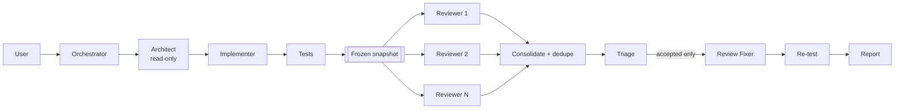

# AI Development Orchestrator

**English** | [日本語](README.ja.md)

A general-purpose [Agent Skill](https://code.claude.com/docs/en/skills) that
orchestrates a full software-development workflow across **multiple AI coding
CLIs** — design with one model, implement with another, then have several
models review the result independently before anything is called done. It
works with any codebase, and runs only the stages a request needs: a typo fix
skips straight to the edit; a schema change gets the full pipeline.

## Why this exists

**A model reviewing its own work is a weak reviewer.** It shares the
assumptions that produced the bug. Two or three *different* models, each seeing
the same diff with no knowledge of the others' opinions, disagree in useful
ways — and the disagreements are where the real bugs are.

**Raw review output is not a fix list.** Multiple reviewers duplicate each
other, some findings are false positives, and forwarding all of it to a fixer
produces churn. So findings are deduplicated mechanically and then *triaged* by
the orchestrator; only accepted findings reach the fixer. And no model name is
ever guessed: configuration names a *family* plus `version: latest`, and an
adapter that cannot verify it raises an error.

## Who does what

| Stage | Role in the config | What it does |
| --- | --- | --- |
| Direction | `orchestrator` | Decides which stages a request needs, digests bulk input, merges the results |
| Design | `architect` | Investigates and writes the plan, read-only; nothing is implemented until you approve it |
| Implementation | `implementer` | Writes the code and the tests from the plan |
| Review | reviewers | Two or more models read the same frozen diff, read-only, without seeing each other |
| Fix | `review_fixer` | Fixes only the findings the orchestrator accepted |


```mermaid
flowchart LR
    U[User] --> O[Orchestrator]
    O --> A[Architect<br/>read-only]
    A --> I[Implementer]
    I --> T[Tests]
    T --> S[[Frozen snapshot]]
    S --> R1[Reviewer 1]
    S --> R2[Reviewer 2]
    S --> R3[Reviewer N]
    R1 --> C[Consolidate + dedupe]
    R2 --> C
    R3 --> C
    C --> TR[Triage]
    TR -->|accepted only| F[Review Fixer]
    F --> T2[Re-test] --> REP[Report]
```

The shape that matters: **one vendor designs, another reviews.** Two models
from the same family share the blind spot that produced the bug.

## Requirements

- **Python 3.11+** — standard library only (PyYAML is used if present). Run
  `python3` where that is its only name, or `bin/dev-orchestra[.ps1]`, which finds it.
- **git** — required for review snapshots.
- **At least one supported CLI**, already authenticated:
  - [Claude Code](https://claude.com/claude-code) (`claude`)
  - [Codex CLI](https://developers.openai.com/codex/cli) (`codex`)
  - Antigravity CLI (`agy`), for the implementer and the review fixer: it has
    no read-only mode, so a plan or review seat on it is taken only from the
    global config, with a warning (see `references/providers.md`)

The skill runs as a plugin in Claude Code, Codex or Antigravity; the CLIs above
are what it drives, not where it runs.

The skill uses **your existing CLI logins**. It never asks for an API key, never
stores credentials, and never prints them.

## Installation

Install it as a plugin from this repository (it is on no official marketplace).
Claude Code and Codex each run their own copy from their cache
(`~/.claude/plugins/cache/…`, `~/.codex/plugins/cache/…`), available from the
next session. Antigravity loads the directory placed in its `plugins/` folder.

### Claude Code plugin

```bash
claude plugin marketplace add istb16/dev-orchestra
claude plugin install dev-orchestra@dev-orchestra
```

Inside Claude Code: `/plugin marketplace add istb16/dev-orchestra`, then
`/plugin install dev-orchestra@dev-orchestra`.

### Codex plugin

```bash
codex plugin marketplace add istb16/dev-orchestra
codex plugin add dev-orchestra@dev-orchestra
```

`codex plugin list` shows what is installed.

### Antigravity plugin

Clone the repository and link it into Antigravity's plugins folder:

```bash
git clone https://github.com/istb16/dev-orchestra.git
cd dev-orchestra
./install/install.sh --antigravity    # links into ~/.gemini/config/plugins/
```

```powershell
.\install\install.ps1 -Antigravity    # Windows
```

By hand it is one link: `ln -s "$PWD" ~/.gemini/config/plugins/dev-orchestra`.
`--project <path>` installs into `<path>/.agents/plugins/` instead. Restart
Antigravity afterwards: a new plugin directory is only discovered on startup.
A linked install loads whatever branch the checkout has, so look at an
untrusted branch with `--copy` or from a separate worktree. The Antigravity
CLI can also stage a copy with `agy plugin install <path>`, which copies the
checkout as it is, and a `plugins.json` entry can point at the folder that
contains the checkout, which loads it live; both carry the same
untrusted-branch caution, and neither is guarded by the installer or checked
by `doctor` ([details](references/workflow.md#installing-from-a-skill-checkout)).
The Marketplace is curated by Google and takes no user-added entries.

The installers from before the plugin still work ([Installing from a skill checkout](references/workflow.md#installing-from-a-skill-checkout));
running the plugin from a clone is in `CONTRIBUTING.md`.

## Initial setup

On first use the skill notices there is no configuration, shows the one in
force, and asks which preset to save: `quality`, `standard` or `fast`. A preset
sets the roles, the reviewer panel, the design review and the optimization
level, fitted to the CLIs installed on the machine, so a machine with Claude
Code alone gets a Claude-only panel. To choose yourself, or to answer every
question in the wizard:

```bash
dev-orchestra config setup --preset standard
dev-orchestra config setup
dev-orchestra model list        # the families your installed CLIs offer
```

Until a file is saved, `standard` fitted to the installed CLIs is in force.
With Claude Code and Codex both installed that is the recommended lineup: a
Claude `fable` architect, Claude `opus` for implementation and fixes, one
Claude and one Codex reviewer. The file keeps only what you chose. See
[presets](references/configuration.md#presets),
[the wizard](references/configuration.md#the-wizard) and a
[two-vendor lineup](references/configuration.md#worked-examples).

## Usage

Talk to your agent normally — "Implement this issue using the configured
workflow", "Investigate and fix the checkout timeout", "Run a multi-model
review of this branch against main", "Add a security reviewer using Codex".
One sentence runs as much of the pipeline as the request needs. To drive a
stage yourself, these are the commands the orchestrator issues underneath
([workflow](references/workflow.md) explains each one):

```bash
# first write the design request to <Artifacts>/execution/request.md (workflow show)
dev-orchestra run architect --prompt-file .ai/execution/request.md --output .ai/plan.md
dev-orchestra design approve            # after you have read the plan
dev-orchestra run implementer --prompt-file .ai/plan.md
# run the project's own tests, then record the outcome
dev-orchestra state record test ok
dev-orchestra review snapshot --base main
dev-orchestra review run
dev-orchestra review triage F1 --status accepted --note "confirmed"
dev-orchestra review fix-brief --output .ai/fix-brief.md
dev-orchestra run review_fixer --prompt-file .ai/fix-brief.md
# the same tests again, and record the outcome
dev-orchestra state record test ok
dev-orchestra review status             # another round, or report
```

For logs or a long spec, digest the bulk first and design from the summary
([Feeding it a lot of text](references/limits.md#feeding-it-a-lot-of-text)):

```bash
dev-orchestra run orchestrator --prompt-file .ai/execution/analysis-request.md --output .ai/analysis.md
```

## Configuration

Precedence is **project → global → built-in defaults**:
`<repo>/.dev-orchestra.yaml`, then `~/.config/dev-orchestra/config.yaml`
(`%APPDATA%\dev-orchestra\config.yaml` on Windows). `dev-orchestra config show`
prints the result; `config set` changes one value. The schema, every field and
worked examples: [configuration](references/configuration.md).

`dev-orchestra config set language.reply ja` (or `ko`, `zh-TW`, `es`, `fr`, any
language tag) fixes the language the orchestrator answers in. dev-orchestra
adds three hooks to your Claude Code user settings (`~/.claude/settings.json`,
backed up first) that remind it before each prompt and ask once for a reply
clearly in another language to be written again; elsewhere `doctor` passes the
setting on to the skill. `--no-hooks` saves the setting alone, `dev-orchestra
hooks status` shows them, and clearing the setting removes them. A project's
`.dev-orchestra.yaml` that sets a language never installs them by itself. What is
checked, how the hooks are written and their limits:
[Reply-language hooks](references/architecture.md#reply-language-hooks).

## Model selection

A role stores a family and `version: latest` (or `pinned` with an exact id),
resolved against the installed CLI on every run
([model families](references/configuration.md#model-families-and-version-policy));
`model_tiers` gives one role a cheaper or second-opinion model on request
([model tiers](references/configuration.md#model-tiers)).

## Reviewers

Zero or more; two or more recommended. `dev-orchestra reviewer add --provider codex --role security`
adds one. A second round reviews only the fix, and lockfiles and bundles are
withheld. Roles, the snapshot, dedup and triage: [reviews](references/reviews.md).

## Example workflows

A Rails feature, an API change, a typo, a review on its own, and a dry run with
the mock provider: [Example workflows](references/workflow.md#example-workflows).

## Troubleshooting

`dev-orchestra doctor` checks the CLIs, the configuration and the model
families; `doctor --json` gives the same machine-readable. Symptoms and fixes:
[Troubleshooting](references/cli.md#troubleshooting).

## Security

Credentials are never requested, stored or printed. The architect and every
reviewer run read-only, enforced by the CLI rather than the prompt; the skill
has no network access of its own. Details, including what `--restricted` means
for your `permissions.deny` rules: [Security](references/architecture.md#security).

## Supported platforms

Linux, macOS and native Windows (`bin\dev-orchestra.ps1`) are CI-tested; WSL
works as Linux and is not required. Everything is pure Python plus `git`. The
Antigravity install on Windows makes a junction, which needs no Developer Mode.

## Upgrading

```bash
/plugin marketplace update                     # Claude Code, inside a session
codex plugin marketplace upgrade               # Codex: re-fetches the snapshot only,
codex plugin add dev-orchestra@dev-orchestra   # so add it again to install it
```

A checkout install upgrades with `git pull` ([details](references/workflow.md#installing-from-a-skill-checkout)).
Antigravity: `git pull` in the checkout, then restart Antigravity.
Configuration, artifacts and commands are compatible within a major version
([Compatibility](#compatibility)); `CHANGELOG.md` calls out anything that needs
action.

## Uninstalling

```bash
dev-orchestra hooks uninstall   # the reply-language hooks in your Claude Code settings, if any
claude plugin uninstall dev-orchestra
codex plugin remove dev-orchestra@dev-orchestra
dev-orchestra config reset --scope global --delete   # optional: your configuration
```

Configuration stays unless you remove it; delete `.ai/` in a project to drop
its artifacts. A checkout install has `install/uninstall.sh` (`.ps1` on Windows).
Antigravity: `./install/uninstall.sh --antigravity` (`-Antigravity` on Windows), then restart it.

## Compatibility

[Semantic versioning](https://semver.org/) from 1.0.0: a breaking change to
anything listed as covered is a major version, an addition is a minor version,
a fix is a patch. `CHANGELOG.md` ([Keep a Changelog](https://keepachangelog.com/))
calls out anything that needs action. Before 1.0.0 a minor release could still
break these, and says so under Changed in `CHANGELOG.md` with what to do — as
the release that narrowed `review.timeout_seconds` to reviewers did.

Covered:

- **The configuration schema** (`version: 1`): every documented key of
  `config.yaml` and `.dev-orchestra.yaml` and the values it accepts. A key may
  be added; a key is not removed, renamed or given a new meaning or type, and a
  file that validates keeps validating. A built-in default may change in a
  minor version and is listed under Changed with the old and the new value.
- **The `dev-orchestra` commands, their flags and their exit codes**
  ([cli](references/cli.md)). A command, a flag or an exit code may be added;
  none is removed or changes meaning.
- **The environment variables** `DEV_ORCHESTRA_CONFIG`, `DEV_ORCHESTRA_HOME`,
  `DEV_ORCHESTRA_WORKFLOW`, `DEV_ORCHESTRA_SESSION` and
  `DEV_ORCHESTRA_NO_USER_PROVIDERS`.
- **The `--json` output of every command**: a key may be added; a key is not
  removed, renamed or given a new meaning or type. The documented values of a
  field that takes one of a list (`status`, `coverage`, `resume.reason`) are
  kept; the sentences inside `notes` and `warnings` are text and are not.
- **The `.ai/` artifact formats**: what dev-orchestra writes under
  `.ai/workflows/<id>/` and `.ai/current.json`, by the rule under "How the
  formats change" in [workflow](references/workflow.md#artifacts). A reviewer
  or architect report is the model's own text: its path is covered, its
  wording is not.
- **What the built-in adapters do** (claude, codex, agy, mock): the modes, the
  read-only enforcement, resuming, what a run records. The flags they pass to
  their CLIs are not.
- **What the reply-language hooks do** ([Reply-language hooks](references/architecture.md#reply-language-hooks)):
  dev-orchestra adds them to your Claude Code user settings only when you set
  `language.reply` or run `hooks install`. It changes only its own entries
  there and removes them with `hooks uninstall` or when `language.reply` is
  cleared. They act only with `language.reply` set, only in a session that
  used dev-orchestra, and never in a run it delegated. They block a reply at
  most once, and they fail open, printing nothing on any error. Not covered:
  the thresholds, what is stripped before judging, the reason wording, the
  relay script and its record, and the exact `command`/`args` of the entries.
- **The minimum Python version and the supported platforms**: raising or
  dropping one is a major version.

Not covered, and may change in a minor version:

- **The `Provider` base class** a user adapter subclasses, with the types
  around it ([providers](references/providers.md#interface-stability)). Such
  a change is listed in `CHANGELOG.md` in an entry that begins
  **User adapters**.
- **The human-readable output** of every command. Read `--json` where a
  program needs it.
- **`scripts/smoke_live.py` and the other maintenance scripts**
  (`stamp_translation.py`, `doc_contents.py`, `validate_skill.py`), their
  `--json`, and the `verified/` records they write in the config directory:
  per-machine records with a `schema` number, reported by `doctor` and remade
  by running the script again when the schema moves.
- **The modules under `scripts/orchestrator/`** as a Python API.
- **The wording of `skills/dev-orchestra/SKILL.md`** and the prompt templates.
  The commands they invoke are covered above.
- **`DEV_ORCHESTRA_MOCK_*`** and `DEV_ORCHESTRA_TEST_ASSUME_NO_CLI`, which are
  test instruments.
- **`DEV_ORCHESTRA_DELEGATED`**, which the providers set on the processes they
  start so the hooks stay out of delegated runs: internal.

## Architecture

Judgement stays in the model, mechanics in code: `skills/dev-orchestra/SKILL.md`
says what to run, `scripts/dev_orchestra.py` does the deterministic parts, and
only the providers know CLI flags and model names — your own adapter goes in
`<config dir>/providers/` ([providers](references/providers.md)).
[architecture](references/architecture.md) has the long version.

## Reference documents

The detail behind this README. They are written for the orchestrating model
as much as for you, which is why they are written in English. A Japanese
translation of each, for people to read, is in [docs/ja/references/](docs/ja/references/).

| Document | What it answers |
| --- | --- |
| [references/workflow.md](references/workflow.md) | What each stage does, the prompt templates, the `.ai/` artifacts, example workflows, installing from a checkout |
| [references/configuration.md](references/configuration.md) | The schema, layering, every field, model families and tiers, the wizard, worked examples |
| [references/providers.md](references/providers.md) | The adapter interface, Claude, Codex and agy, adding a CLI |
| [references/reviews.md](references/reviews.md) | The snapshot, withheld files, the fix-only second round, output schema, dedup, triage |
| [references/architecture.md](references/architecture.md) | How the pieces fit, why, and the security model |
| [references/limits.md](references/limits.md) | Stalls, timeouts, budgets, bulk input, what a run costs, the optimization level |
| [references/cli.md](references/cli.md) | Every command and flag, and troubleshooting |

## Contributing

Issues and pull requests welcome — see `CONTRIBUTING.md`, which also says how
to report a security problem. Adapter fixes for a CLI that changed its flags or
model names are the most valuable contribution.

## Documentation language

The skill and `references/` are English, which AI models read best; the README
is in [English](README.md) and [日本語](README.ja.md). The translations in
`docs/ja/references/` are for people, the English stays authoritative, and the
tests fail when the English moves on without them (each names its sha256).

## License

MIT — see `LICENSE`.
