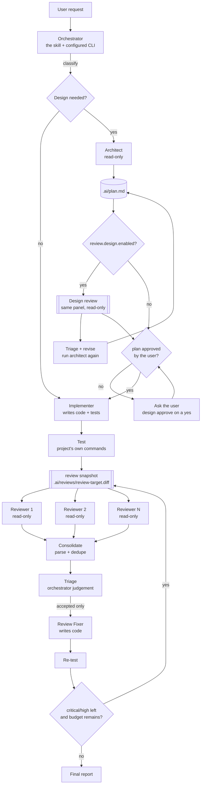

<!-- translated-from: references/architecture.md sha256:69a2c8e330ac40dcf5de07674a96cfcd04805b6e75801fd057463c6a2cc8d0a3 -->

> この文書は [references/architecture.md](../../../references/architecture.md) の日本語訳です。内容が食い違うときは英語版が正です。

<a id="architecture"></a>

# アーキテクチャ

<a id="the-shape-of-the-thing"></a>

## 全体の形

このスキルは、**薄い決定的なレイヤーの上に載ったプロンプト駆動のオーケストレーション**です。判断はモデルに任せ、機械的な処理はコードに任せます。



<a id="layers"></a>

## レイヤー

| レイヤー | 置き場所 | 責務 |
| --- | --- | --- |
| スキル | `skills/dev-orchestra/SKILL.md`, `references/` | オーケストレーターが何をいつ決めるか |
| CLI | `scripts/dev_orchestra.py`, `scripts/orchestrator/cli.py` | エージェントが呼び出せる決定的な操作 |
| ドメイン | `config.py`, `review.py`, `workspace.py`, `wizard.py`, `doctor.py` | 設定のレイヤリング、スナップショット取得、パース、重複排除、トリアージ、診断 |
| provider | `scripts/orchestrator/providers/` | CLI の構文とモデル名を知っている唯一のコード |

provider レイヤーより上のコードは、`claude` が `--model` を使い `codex` が `-m` を使うことを一切知りません。スキルレイヤーより下のコードは、設計ステージが必要かどうかを一切判断しません。

<a id="why-this-split"></a>

## なぜこの分け方なのか

**判断は再現できませんが、配管は再現できなければなりません。** 指摘の重複排除、diff の固定、設定ファイルのレイヤリングは毎回同じ答えを返すので、コードとして実装され、テストされています。ある指摘が*この*コードベースにおける本物のバグかどうかを判断することは、まさにモデルが得意とすることなので、プロンプトに残します。

**レビューは独立していなければ価値がありません。** 互いの出力を見る 3 つのモデルは同じ結論に収束しますが、互いを見ない 3 つのモデルは有益な形で意見が分かれます。そのため、ファンアウトはコードで行います。同じ固定スナップショット、分離されたプロセス、共有コンテキストなし、読み取り専用のサンドボックスです。これは、プロンプトが編集されたからといって誤って破られることはありません。

**モデルはスキルよりも速く変わります。** 日付付きのモデル ID は何も永続化されません。設定には `family` + `version: latest` を保存し、adapter がそれを、インストール済みの CLI がその時点で示す内容に照らして解決します。モデルを検証できない adapter は、推測せずに例外を送出します。

**認証は CLI の責任です。** スキルは `claude` と `codex` を、ユーザーの環境を継承したサブプロセスとして実行するので、既存のサブスクリプションやログインがそのまま使えます。スキルは認証情報を保存せず、読み取りもしません。

<a id="data-flow"></a>

## データフロー

```
project/
├── .dev-orchestra.yaml         # optional per-project override
└── .ai/                          # working artifacts (self-ignoring)
    ├── plan.md                   # Architect output
    ├── execution/                # prompts you wrote, fix brief, role outputs
    ├── reviews/
    │   ├── review-target.diff    # the frozen snapshot every reviewer sees
    │   ├── review-target.json    # strategy, files, sha256
    │   ├── <reviewer-id>.md      # one report per reviewer
    │   ├── consolidated.md       # deduped findings, human readable
    │   ├── consolidated.json     # deduped findings + triage state
    │   └── design/               # the same files for the design review, so
    │                             # its rounds and triage stay its own
    └── state.json                # stage events with resolved model ids
```

`consolidated.json` はステージ間の受け渡しに使われます。`review run` がこれを書き出し、トリアージがこれに注記を加え、`review fix-brief` がこれを読み込み、`review status` がもう 1 ラウンド必要かどうかを判断します。

<a id="extension-points"></a>

## 拡張ポイント

- **新しい CLI**: `providers/` にモジュールを 1 つ追加し、`register()` を 1 回呼び出すだけです。あるいは、プラグインを編集せずに `<config dir>/providers/` にモジュールを 1 つ置くこともできます。これは組み込みの provider の後に import され、プラグインを更新しても残ります。`references/providers.md` を参照してください。
- **新しいレビュアーロール**: 任意の文字列が使えます。組み込みのロールには、より的確なプロンプトのガイダンス（`review.py` の `ROLE_GUIDANCE`）が付くだけです。
- **別のワークスペースの場所**: 設定の `workspace.dir` で指定します。
- **別のレビュープロンプト**: `build_review_prompt` はテンプレートを受け取れます。

<a id="deliberate-non-goals"></a>

## 意図的に目標としないこと

- デーモンもサーバーも持たず、プロジェクトと設定ファイルの外に状態を持ちません。
- 自前のネットワークアクセスは行いません。ネットワーク通信は CLI がそれぞれ行います。
- リリースのたびに更新しなければならないモデルカタログを同梱しません。
- オーケストレーション用の DSL はありません。パイプラインは文章で説明できるほど短いからです。
