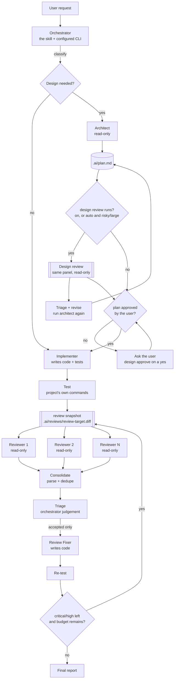

<!-- translated-from: references/architecture.md sha256:30308364a2aa248e96041620bd5a69db286fdea4e709e989dd39fe6b9d1fc6c1 -->

> この文書は [references/architecture.md](../../../references/architecture.md) の日本語訳です。内容が食い違うときは英語版が正です。

<a id="architecture"></a>

# アーキテクチャ

<!-- contents: start -->

**目次**

- [全体の形](#the-shape-of-the-thing)
- [レイヤー](#layers)
- [なぜこの分け方なのか](#why-this-split)
- [データフロー](#data-flow)
- [拡張ポイント](#extension-points)
- [返答の言語のフック](#reply-language-hooks)
- [セキュリティ](#security)
- [意図的に目標としないこと](#deliberate-non-goals)

<!-- contents: end -->

<a id="the-shape-of-the-thing"></a>

## 全体の形

このスキルは、**薄い決定的なレイヤーの上に載ったプロンプト駆動のオーケストレーション**です。判断はモデルに任せ、機械的な処理はコードに任せます。


```mermaid
flowchart TD
    U[User request] --> O[Orchestrator<br/>the skill + configured CLI]
    O -->|classify| D{Design needed?}
    D -->|no| I
    D -->|yes| A[Architect<br/>read-only]
    A --> P[(.ai/plan.md)]
    P --> DR{design review runs?<br/>on, or auto and risky/large}
    DR -->|yes| DP[[Design review<br/>same panel, read-only]]
    DP --> DT[Triage + revise<br/>run architect again]
    DT --> P
    DR -->|no| AP{plan approved<br/>by the user?}
    DP --> AP
    AP -->|no| ASK[Ask the user<br/>design approve on a yes]
    ASK --> AP
    AP -->|yes| I[Implementer<br/>writes code + tests]
    I --> T[Test<br/>project's own commands]
    T --> S[[review snapshot<br/>.ai/reviews/review-target.diff]]
    S --> R1[Reviewer 1<br/>read-only]
    S --> R2[Reviewer 2<br/>read-only]
    S --> R3[Reviewer N<br/>read-only]
    R1 --> C[Consolidate<br/>parse + dedupe]
    R2 --> C
    R3 --> C
    C --> TR[Triage<br/>orchestrator judgement]
    TR -->|accepted only| F[Review Fixer<br/>writes code]
    F --> T2[Re-test]
    T2 --> Q{critical/high left<br/>and budget remains?}
    Q -->|yes| S
    Q -->|no| REP[Final report]
```

<a id="layers"></a>

## レイヤー

| レイヤー | 置き場所 | 責務 |
| --- | --- | --- |
| スキル | `skills/dev-orchestra/SKILL.md`, `references/` | オーケストレーターが何をいつ決めるか |
| CLI | `scripts/dev_orchestra.py`、`scripts/orchestrator/cli.py`（引数の解析と入口）と `cli_*.py`（コマンドのまとまりごとのモジュール） | エージェントが呼び出せる決定的な操作 |
| ドメイン | `config.py`、`config_policy.py`、`config_trust.py`、`review_*.py`（`review.py` が再公開する）、`workspace.py`、`wizard.py`、`doctor.py` | 設定のレイヤリング、プロジェクトファイル由来の席と書き込みオプションを拒否する方針、global 設定だけが決められる設定、スナップショット取得、パース、重複排除、トリアージ、診断 |
| provider | `scripts/orchestrator/providers/` | CLI の構文とモデル名を知っている唯一のコード |
| 返答の言語のフック | `claude_hooks.py`、`scripts/hooks/`、`reply_language.py` | Claude Code のみ: 返答を `language.reply` の言語に保つ（[後述](#reply-language-hooks)） |

provider レイヤーより上のコードは、`claude` が `--model` を使い `codex` が `-m` を使うことを一切知りません。スキルレイヤーより下のコードは、設計ステージが必要かどうかを一切判断しません。

<a id="why-this-split"></a>

## なぜこの分け方なのか

**判断は再現できませんが、配管は再現できなければなりません。** 指摘の重複排除、diff の固定、設定ファイルのレイヤリングは毎回同じ答えを返すので、コードとして実装され、テストされています。ある指摘が*この*コードベースにおける本物のバグかどうかを判断することは、まさにモデルが得意とすることなので、プロンプトに残します。

**レビューは独立していなければ価値がありません。** 互いの出力を見る 3 つのモデルは同じ結論に収束しますが、互いを見ない 3 つのモデルは有益な形で意見が分かれます。そのため、ファンアウトはコードで行います。同じ固定スナップショット、分離されたプロセス、共有コンテキストなし、CLI 自身の強制による読み取り専用（Claude ではツールの許可リストと `--restricted`、Codex ではサンドボックス）です。これは、プロンプトが編集されたからといって誤って破られることはありません。

**モデルはスキルよりも速く変わります。** 日付付きのモデル ID は何も永続化されません。設定には `family` + `version: latest` を保存し、adapter がそれを、インストール済みの CLI がその時点で示す内容に照らして解決します。モデルを検証できない adapter は、推測せずに例外を送出します。

**認証は CLI の責任です。** スキルは `claude` と `codex` を、ユーザーの環境を継承したサブプロセスとして実行するので、既存のサブスクリプションやログインがそのまま使えます。スキルは認証情報を保存せず、読み取りもしません。

<a id="data-flow"></a>

## データフロー

```
project/
├── .dev-orchestra.yaml         # optional per-project override
└── .ai/                          # working artifacts (self-ignoring)
    ├── current.json              # the workflow this directory last resolved
    └── workflows/<id>/           # one per workflow (`workflow show`)
        ├── plan.md               # Architect output
        ├── execution/            # prompts you wrote, fix brief, role outputs
        ├── jobs/                 # detached runs
        ├── reviews/
        │   ├── review-target.diff    # the frozen snapshot every reviewer sees
        │   ├── review-target.json    # strategy, files, sha256
        │   ├── review-surrounding.json  # enclosing symbols, only with review.context.surrounding: enclosing
        │   ├── <reviewer-id>.md      # one report per reviewer
        │   ├── consolidated.md       # deduped findings, human readable
        │   ├── consolidated.json     # deduped findings + triage state
        │   ├── rounds/               # consolidated.json of every round, kept after the next
        │   └── design/               # the same files for the design review, so
        │                             # its rounds and triage stay its own
        └── state.json            # stage events with resolved model ids
```

`consolidated.json` はステージ間の受け渡しに使われます。`review run` がこれを書き出し、トリアージがこれに注記を加え、`review fix-brief` がこれを読み込み、`review status` がもう 1 ラウンド必要かどうかを判断します。

<a id="extension-points"></a>

## 拡張ポイント

- **新しい CLI**: `providers/` にモジュールを 1 つ追加し、`register()` を 1 回呼び出すだけです。あるいは、プラグインを編集せずに `<config dir>/providers/` にモジュールを 1 つ置くこともできます。これは組み込みの provider の後に import され、プラグインを更新しても残ります。`references/providers.md` を参照してください。
- **新しいレビュアーロール**: 任意の文字列が使えます。組み込みのロールには、より的確なプロンプトのガイダンス（`review_common.py` の `ROLE_GUIDANCE`）が付くだけです。
- **別のワークスペースの場所**: 設定の `workspace.dir` で指定します。
- **別のレビュープロンプト**: `build_review_prompt` はテンプレートを受け取れます。

<a id="reply-language-hooks"></a>

## 返答の言語のフック

ルール 11 はオーケストレーターにユーザーの言語で答えるよう求めていますが、それを確かめるものはありません。英語の計画書、指摘、CLI の出力を何ページも読んだあとでは、返答が英語に流れていきます。`language.reply` を設定すると（[設定](configuration.md#field-reference)）、dev-orchestra が Claude Code に 3 つのフックを加えてこのルールを支えます。設定しない人には、フックも、Python の起動も、フックのエラーもありません。dev-orchestra 自身のファイルのほかには何も書き込みません。

**どこに入れるか。** Claude Code の*ユーザー*設定です。`CLAUDE_CONFIG_DIR` が設定されていれば `$CLAUDE_CONFIG_DIR/settings.json`、なければ `~/.claude/settings.json` です。プロジェクトの `.claude/settings.json` や `settings.local.json` には決して入れません。コマンドはこのマシン上のパスであり、プロジェクトのファイルはよくコミットされます。フックは作業ディレクトリから各プロジェクトの `.dev-orchestra.yaml` を読むので、ユーザー単位で 1 回入れればすべてのプロジェクトで使えます。`config setup --language <tag>`、ウィザードの最後の質問、`config set language.reply <tag>` は、タグのなかったファイルにタグを設定したとき、Claude Code の設定ディレクトリがすでにあればフックを入れます（なければそう伝え、`hooks install` がディレクトリを作ります）。`hooks install` はいつでも入れます。ほかのファイルだけが設定しているタグ（クローンに付いてくるプロジェクトの `.dev-orchestra.yaml` など）でフックを入れることはなく、`config reset` も入れません。すでにタグのあったファイルでタグを変えたとき、フックが入っていなければ入れず、`hooks install` を案内する `note:` を出します。フックは意図して省かれた（`--no-hooks`）か外されたものだからです。入っているが古いフックは、これらのコマンドのどれかでタグを設定すれば直します。ファイルから `language.reply` を消して、グローバルのファイルにもこのプロジェクトのファイルにも設定がない状態にすると（`config set language.reply null`、`config reset`、`config setup`）フックを外し、ほかのプロジェクトでファイルに設定していればそこでも判定が止まる、と伝えます。グローバルのタグをそのプロジェクトでだけ取り消すプロジェクトの `null` では外しません。`--no-hooks` を付けると設定だけを保存して Claude Code には触れません。このツールが委譲した実行の中でも触れません。イベントごとにマッチャーのグループを 1 つ、ユーザー自身のグループのあとに加えます。

```json
{"hooks": {
  "UserPromptSubmit": [{"hooks": [{"type": "command", "command": "C:/Python312/python.exe",
      "args": ["-I", "C:/…/AppData/Roaming/dev-orchestra/hooks/dev_orchestra_hook.py", "prompt"],
      "timeout": 10}]}],
  "SessionStart": [{"matcher": "compact|resume", "hooks": [{"…": "…", "args": ["-I", "…", "session-start"]}]}],
  "Stop": [{"hooks": [{"…": "…", "args": ["-I", "…", "stop"]}]}]
}}
```

**ユーザーのファイルの書き換え方。** `command` 型のフックで、`args` がちょうど `-I`、中継スクリプト、`prompt`・`session-start`・`stop` のどれか、の 3 つであれば dev-orchestra のエントリとみなします。中継スクリプトとみなすのは、`hooks/dev_orchestra_hook.py` のうち、いまの中継スクリプトそのもの、中継スクリプトの見出し行で始まるもの、もう存在しないもの、のどれかです。そのため、設定ディレクトリが移ったあとに入れ直しても、古いエントリを置き換え、二重には入れません。たまたま同じ名前のユーザー自身のフックには触れません。変えるのはそのエントリだけで、ほかのキーはすべて元の位置に残します。ファイルは UTF-8 で読み（BOM があってもかまいません）、解析できない、オブジェクトでない、`hooks`（`null` を含む）・イベント・グループ・グループの `hooks` の一覧の形が違う、のどれかなら拒否します（終了コード 2、何も書きません）。書き換えると書式が整え直されるので、書き込むたびに先に元のファイルをバイト単位で `settings.json.dev-orchestra-backup` に写します（ファイルは 1 つで、毎回上書きします）。新しい内容は隣の一時ファイルに書いて同期し、元のファイルのパーミッションのまま置き換えます。読んだあとにファイルが変わっていれば最初からもう 1 回やり直し、それでも変わっていればあきらめます。dotfile の管理ツールが作るように `settings.json` がリンクなら、リンクのまま残します。書き換えるのはリンク先で、一時ファイルとバックアップもリンク先の隣に置きます。Microsoft Store 版の Python では書き込み先がそのパッケージのフォルダー、つまり Claude Code の読まない場所に移されてしまうので、その場合は拒否します。中継スクリプトは、それを実行するエントリより先に書き、そのあと設定を書き換えられなければ元に戻します。`--dry-run` は同じ変更を表示するだけで、何も書きません。

**何が動くか。** シェルを通さない exec 形式です。コマンドは dev-orchestra を動かした Python の絶対パス（`sys.executable` を絶対パスにしただけで、リンクはたどりません）です。仮想環境の中で動かしたときは、その環境の元になった Python を使います。フックはすべてのプロジェクトで動きますが、仮想環境は 1 つのプロジェクトのもので、信頼できるとは限らず（その `.pth` ファイルは `-I` を付けても起動のたびに実行されます）、消されることもあるからです。その Python が見つからなければ入れるのを拒否します。引数で小さな中継スクリプト `<config dir>/hooks/dev_orchestra_hook.py` を実行します。その隣には記録 `plugin.json` があります。同じコマンドが Git Bash、PowerShell、macOS、Linux で同じように動きます。プラグインのフックではそうはいきません。プラグインのフックは `sh` を通して動くので Git Bash のない Windows では動かず、言語を設定していない人のすべてのセッションでも Python を起動してしまいます。中継スクリプトは標準ライブラリだけを使い、記録（プラグインのチェックアウトと、`hooks install` を実行したときの設定ディレクトリと設定ファイル。後の 2 つは `DEV_ORCHESTRA_HOME` と `DEV_ORCHESTRA_CONFIG` として渡します）を読んで、そのチェックアウトの `scripts/hooks/reply_language.py` を同じプロセスの中で `runpy` で実行します。macOS と Linux では、その前に、チェックアウト、`scripts/`、`scripts/hooks/`、`scripts/orchestrator/`、スクリプトのどれかがほかのユーザーの持ち物か、ほかのユーザーが書き込める（誰でも書き込める、またはユーザー自身のもの以外のグループが書き込める）なら実行しません。処理の本体は `orchestrator/reply_language.py` です。設定は 2 つのファイルから直接読み、provider のレジストリには触れません。そのため、フックがユーザーの adapter を読み込むことはありません。中継スクリプトのディレクトリは、provider の読み込みが import する場所ではありません。

**プラグインの更新に追いつく。** Claude Code の中で実行した dev-orchestra のコマンド（`CLAUDE_CODE_SESSION_ID` があり、委譲された実行ではないもの。`hooks` のコマンドは除きます）は、記録が別のチェックアウトを指しているか中継スクリプトが古ければ、それを書き直します。中継スクリプトを入れていなければ、かかるのは `stat` 1 回だけです。書き直すのは、Claude Code のプラグインのディレクトリ（`<settings dir>/plugins`）の下のチェックアウトか、すでに記録されているチェックアウトから実行したときだけです。フォーク、プルリクエストのブランチ、共有ディレクトリのクローンから一度コマンドを実行しただけで、そのコードが以後すべてのセッションのフックになることはありません。そうしたいときは、そこから `hooks install` を実行します。動かすのはチェックアウトだけで、設定ディレクトリと設定ファイルは `hooks install` が記録したままにします。そのため、一度だけ `DEV_ORCHESTRA_CONFIG` を付けて実行しても、フックの読む設定は変わりません。これを行うのは Claude Code のコマンドだけなので、Codex や Antigravity の別バージョンのチェックアウトが記録を行ったり来たりさせることはありません。更新後に最初のコマンドを実行するまでは古いチェックアウトが動き、そのキャッシュのディレクトリが消えていればフックは黙ります。どのみち、スキルを読み込むかコマンドを実行するまでは、セッションは判定の対象になりません。

**Microsoft Store 版の Python。** `sys.executable` は `%LOCALAPPDATA%\Microsoft\WindowsApps` の下にあるアプリ実行エイリアスです。エイリアスから起動するとフックはパッケージの ID を持ったままになるので、AppData の読み込みは dev-orchestra 自身と同じように振り替えられ、同じ中継スクリプトと `config.yaml` が見つかります。エイリアスの先にある実体は本当の AppData を読んでしまうので、パスはたどりません。同じ理由で、Homebrew や pyenv の Python も、バージョンごとのディレクトリではなく変わらないほうのパスのままにします。

- **UserPromptSubmit** と、コンパクションや再開のあとの **SessionStart** は、言語を名指しした短いリマインダー（約 100 トークン）を加えます。進捗、質問、指摘、報告、ツール呼び出しの説明をその言語で書くこと、利用者が別の言語で頼んだ文章（PR の本文やコミットメッセージ）はその言語のままコードブロックに入れること、という内容です。
- **Stop** は書き終えたばかりの返答（最後のツール呼び出しのあとの文章）を読み、明らかに別の言語で書かれていれば一度だけブロックします。その理由として、同じ返答を省略せず、設定した言語で、ツールを実行せずにもう一度書くよう求めます。ただし利用者がその文章を別の言語で頼んだときは、そのまま終えるよう理由の文に書いてあります。フックに見えるのは返答だけで、依頼は見えないからです。これを止めるのが `language.rewrite: false` です。

**いつ動くか。** `language.reply` が設定されていて、そのセッションが dev-orchestra を使っていて、このツールが委譲した実行の中ではないときだけです。セッションが dev-orchestra を使ったとみなすのは、トランスクリプトにスキルの読み込み、`/dev-orchestra` コマンドの入力、Bash や PowerShell からの `dev_orchestra.py` / `bin/dev-orchestra` の実行が残っているとき（コマンドとして実行したものに限り、`cat` や `git diff` などで名前を挙げただけのものは数えません。サブエージェントの記録も数えません）、またはそのセッションのワークフローディレクトリ `.ai/workflows/<sha256(session id)[:12]>` があるときです。`.ai/` ディレクトリがあるだけでは足りません。それでは、そのプロジェクトで後に開くすべてのセッションが判定の対象になってしまいます。provider が起動するすべての子プロセスには `DEV_ORCHESTRA_DELEGATED=1` が付き、フックはこれを見るとすぐに終わります。そのため、ユーザーの設定を読み込む implementer が、どの言語で答えるか指示されることはありません。

**返答をどう判定するか。** まず、ルール 11 が書かれたままにしてよいとしているものをすべて取り除きます。フェンスで囲んだブロック、HTML コメント、`>` の引用、インラインコード、リンク先、URL とメールアドレス、パス、コマンド行と `--flags`、ASCII のダブルクォートで囲んだ文、数字・`_`・`.`・`:`・`=`・`#`・`@` を含むトークン、大文字小文字の混ざった語とすべて大文字の語、Markdown の表の短いセル（`|` で囲まれた行、または `--- | ---` の区切り行の下の行）です。表のセルはたいてい指摘のタイトルや id やパスを書かれたまま載せているからです。文章として読めるセル（文の終わりがあってラテン文字の単語が 6 語以上、文の終わりが無くても 20 語以上、またはほかの文字体系の文字が 10 字以上）は、まわりの文章と同じく判定します。短いセルのうち文の終わりがあるものの単語を合わせてラテン文字の単語が 40 語以上になる表も、すべてのセルを判定します。そのため、表のセルに書いた返答は、長い文でも短い文でも判定をすり抜けることはありません。文の終わりが無い短いセルはタイトルやラベルとして読み、いくつあっても判定から外します。インラインコードは表を読む前に取り除くので、その中の `|` でセルが分かれることはありません。残った文字を文字体系ごとに数え、その言語自身の文字体系をラテン文字と比べます。ラテン文字 1 文字は、かな・漢字・ハングル 1 文字の 3 分の 1、アルファベット系の文字 1 文字と同じ重みです。どの返答も、その言語以外の文字体系（ラテン文字は除く）の文字が 60 字以上あり、重みを付けてその言語の文字を 70% を超えて上回れば不合格です。`ja` での韓国語の返答や、`ko` での日本語の返答がこれにあたります。日本語では、漢字が 50 字以上あってかながまったくなければ不合格です（それは中国語です）。中国語では、かなが 20 字以上あり、かなと漢字のうち 15% 以上を占めれば不合格です（それは日本語です）。かなは中国語の文字として数えません。それ以外では、ラテン文字の単語が 20 語未満の返答は通します。それより長い返答は、残りのうちその言語の文字体系が 30% 未満のとき、またはラテン文字の単語が 40 語以上ある段落でそれが 10% 未満のときに不合格とします。

- **文字体系で判定する言語**: 日本語、中国語（`zh`、`zh-CN`、`zh-TW`、`zh-Hans`、`zh-Hant` など。簡体字も繁体字も同じに扱います）、韓国語、キリル文字の言語（ロシア語、ウクライナ語、ブルガリア語、セルビア語など）、ギリシャ語、アラビア文字の言語（アラビア語、ペルシャ語、ウルドゥー語）、ヘブライ語、タイ語、デーヴァナーガリー文字の言語（ヒンディー語、マラーティー語、ネパール語）。`sr-Latn` や `zh-Latn-TW` のような文字体系の副タグがあれば、中国語の地域を含め、その言語の通常の文字体系より優先します。
- **よく使う語で判定する言語**: 英語、スペイン語、フランス語、ドイツ語、ポルトガル語、イタリア語。ほかのラテン文字の言語と同じく、返答の大半が別の文字体系なら不合格です。そのうえで、残った語を小文字にしてアクセントは残したまま、言語ごとの短い一覧（`the`、`and`、`of`…、`el`、`los`、`que`…）と照らし合わせます。一覧にあるほかの言語それぞれについて、その言語の一覧にだけある語と、設定した言語の一覧にだけある語を数えます。両方の一覧にある語（`de`、`en`、`a`、`no` など）はどちらにも数えません。一覧の語が 20 語未満の返答は通します。それより長い返答は、ほかの言語にだけある語が 15 語以上で、かつ設定した言語にだけある語の 2 倍以上なら不合格です。したがって `es` で英語の返答、`en` でスペイン語の返答は不合格になり、識別子やコードの多いスペイン語の返答は `es` で通ります。
- **そのほかのラテン文字の言語**（`nl`、`sv`、`pl` など）は、返答の大半が別の文字体系のときだけ不合格になります。語の一覧がないので、ほかのラテン文字の言語とは区別しません。
- **知らないタグ**にはリマインダーだけを出し、判定はしません。

このうちどれに当たるかは `doctor` が示します。

**失敗したら何もしない。** フックがエラーになったとき、入力や設定を解析できないとき、トランスクリプトが見つからないときは、何も出力せずに 0 で終了します。中継スクリプトも、記録や記録の指すチェックアウトがないか実行を断ったとき、実行したフックが例外を出したりどんな終了コードで終わったりしたときは同じです。1 つの返答をブロックするのは多くても 1 回です。書き直された返答は `stop_hook_active` 付きで届き、フックはそれを通します。理由の文面は判定が読み取る書き方（コードはバッククォート、引用した文は `>` の引用）を教えます。判定がユーザーの返答を誤判定するときの逃げ道が `language.rewrite: false` です。

**ホスト。** フックを実行するのは Claude Code だけです。Codex と Antigravity には、`doctor`（スキルはその *Reply language* の行を、ユーザーが頼んだ言語として読みます）とルール 11 で設定が伝わります。どのプラグインのマニフェストもフックを指定せず、プラグインのルートに `hooks/` ディレクトリもありません（`validate_skill.py` が両方を確かめます）。Claude Code の側は `doctor` と `hooks status` が伝えます。`installed`、理由付きの `stale`（`python-differs`、`python-missing`、`relay-missing`、`relay-outdated`、記録が別のチェックアウトを指すときの `plugin-root-differs`、記録がないか、いま使われているのと別の設定ディレクトリや設定ファイルを指すときの `record-differs`、あるイベントにこちらのフックがないか 2 つ以上あるときの `events-missing`、フックがユーザーのグループの中や別のイベントにあるか、マッチャー・タイムアウト・引数が違うときの `entries-differ`）、`not-installed`、`unreadable` のどれかと、`disableAllHooks` が設定されているかどうかです（そのときも入れはしますが、警告します）。

**限界。** 判定するのはターンの最後のメッセージだけです。ターンの途中の英語の進捗行は、リマインダーで防ぐものです。Claude Code はセッションの開始時にフックを読むので、最初に入れたフックが効くのは次のセッションからです（`/hooks` で確かめたあとでも効きます）。フックを入れた Python が消えたり、新しいフォルダーへ上げられたりすると（venv の削除、python.org 版のマイナーバージョンの更新）、フックは黙って止まります。`doctor` は `python-missing` か `python-differs` と直し方を示しますが、dev-orchestra は頼まれないかぎり設定を書き直しません。管理者の設定でユーザーのフックが止められていることもあり、`doctor` からはそれが見えません。言語を設定すると、dev-orchestra を使わないセッションも含め、Claude Code のすべてのセッションでプロンプトと Stop のたびに Python が起動します（Windows で 50〜100 ms）。対象外のセッションでは、範囲の判定のあとすぐに終わります。しきい値、取り除くもの、理由の文面はフィクスチャで調整しており、マイナーリリースで変わることがあります。何を約束しているかは README.md の「互換性」の節にあります。

<a id="security"></a>

## セキュリティ

- **認証情報を要求も保存も出力もしません。** スキルはユーザーの環境を引き継ぎ、
  CLI 側の既存の認証に頼ります。
- `doctor` が報告するのは認証情報の *存在*（`present` / `unknown`）だけで、値は出しません。
- 取得した stdout/stderr は、`.ai/` に書かれたり表示されたりする前に、認証情報らしき
  文字列を取り除く redactor を通ります（`references/providers.md`）。
- architect とレビュアーは読み取り専用で動き、それはプロンプトではなく CLI が強制します。
  Claude は plan モード、`Read`・`Grep`・`Glob` のツールだけ、MCP サーバーなし、
  `--restricted` で動くので、シェルはなく、リポジトリの設定ファイルのフックも動かず、
  作業ディレクトリと `--add-dir` の外は読めません。Codex は `-s read-only` で書き込みが
  止まりますが、MCP サーバーは確認していません。`--restricted` のため、ユーザー自身の
  `permissions.deny` もこれらの Claude の実行には効きません。そうしたルールは
  managed settings に置くものです。
- 読み取り専用の実行は、それを緩めうる生の引数を拒否します。Claude が受け付けるのは
  global 設定か `--extra` からの `--add-dir <path>` だけで（project ファイルからは
  受け付けません）、Codex は何も受け付けません。拒否のメッセージは値を表示しません。
  [ロールのオプション](configuration.md#role-options) を参照してください。
- 成果物は `.ai/` に置かれ、`.ai/` は既定で自分自身を git の管理外にします。

セキュリティ上の問題は、`CONTRIBUTING.md` にあるとおり非公開で報告してください。

<a id="deliberate-non-goals"></a>

## 意図的に目標としないこと

- デーモンもサーバーも持たず、プロジェクトと設定ファイルの外に状態を持ちません。
- 自前のネットワークアクセスは行いません。ネットワーク通信は CLI がそれぞれ行います。
- リリースのたびに更新しなければならないモデルカタログを同梱しません。
- オーケストレーション用の DSL はありません。パイプラインは文章で説明できるほど短いからです。
