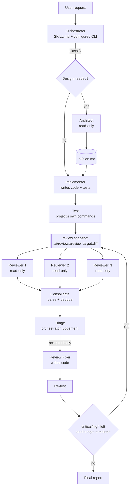

# Architecture

## The shape of the thing

The skill is **prompt-driven orchestration over a thin deterministic layer**.
Judgement stays in the model; mechanics stay in code.



## Layers

| Layer | Lives in | Responsibility |
| --- | --- | --- |
| Skill | `SKILL.md`, `references/` | What the orchestrator decides and when |
| CLI | `scripts/ai_orchestrator.py`, `scripts/orchestrator/cli.py` | Deterministic operations an agent can call |
| Domain | `config.py`, `review.py`, `workspace.py`, `wizard.py`, `doctor.py` | Config layering, snapshotting, parsing, dedupe, triage, diagnostics |
| Providers | `scripts/orchestrator/providers/` | The only code that knows CLI syntax and model names |

Nothing above the provider layer knows that `claude` uses `--model` and `codex`
uses `-m`. Nothing below the skill layer decides whether a design stage is
warranted.

## Why this split

**Judgement is not reproducible; plumbing must be.** Deduplicating findings,
freezing a diff, and layering config files give the same answer every time, so
they are code and they are tested. Deciding whether a finding is a real bug in
*this* codebase is exactly what a model is for, so it stays in the prompt.

**Reviews must be independent to be worth anything.** Three models that see each
other's output converge; three that don't, disagree usefully. So the fan-out is
code: same frozen snapshot, isolated processes, no shared context, read-only
sandboxes. It cannot be accidentally violated by a prompt that gets edited.

**Models change faster than skills do.** Nothing persists a dated model id. The
config stores `family` + `version: latest`, and adapters resolve that against
whatever the installed CLI says today. An adapter that cannot verify a model
raises instead of guessing.

**Auth belongs to the CLIs.** The skill runs `claude` and `codex` as
subprocesses with the user's environment inherited, so existing subscriptions
and logins just work. The skill stores no credentials and reads none.

## Data flow

```
project/
├── .ai-orchestrator.yaml         # optional per-project override
└── .ai/                          # working artifacts (self-ignoring)
    ├── plan.md                   # Architect output
    ├── execution/                # prompts you wrote, fix brief, role outputs
    ├── reviews/
    │   ├── review-target.diff    # the frozen snapshot every reviewer sees
    │   ├── review-target.json    # strategy, files, sha256
    │   ├── <reviewer-id>.md      # one report per reviewer
    │   ├── consolidated.md       # deduped findings, human readable
    │   └── consolidated.json     # deduped findings + triage state
    └── state.json                # stage events with resolved model ids
```

`consolidated.json` is the hand-off between stages: `review run` writes it,
triage annotates it, `review fix-brief` reads it, `review status` decides
whether another round is warranted.

## Extension points

- **A new CLI**: one module in `providers/` plus one `register()` call. See
  `references/providers.md`.
- **A new reviewer role**: any string works; built-in roles just get sharper
  prompt guidance (`ROLE_GUIDANCE` in `review.py`).
- **A different workspace location**: `workspace.dir` in the config.
- **A different review prompt**: `build_review_prompt` accepts a template.

## Deliberate non-goals

- No daemon, no server, no state outside the project and the config file.
- No network access of its own; the CLIs do their own networking.
- No vendored model catalogue that has to be updated on a release cadence.
- No orchestration DSL — the pipeline is short enough to describe in prose.
