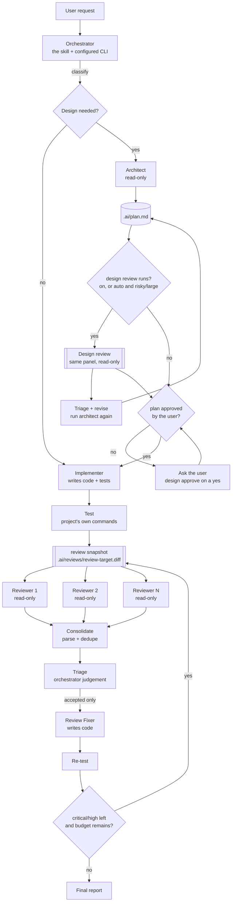

# Architecture

<!-- contents: start -->

**Contents**

- [The shape of the thing](#the-shape-of-the-thing)
- [Layers](#layers)
- [Why this split](#why-this-split)
- [Data flow](#data-flow)
- [Extension points](#extension-points)
- [Reply-language hooks](#reply-language-hooks)
- [Security](#security)
- [Deliberate non-goals](#deliberate-non-goals)

<!-- contents: end -->

## The shape of the thing

The skill is **prompt-driven orchestration over a thin deterministic layer**.
Judgement stays in the model; mechanics stay in code.


```mermaid
flowchart TD
    U[User request] --> O[Orchestrator<br/>the skill + configured CLI]
    O -->|classify| D{Design needed?}
    D -->|no| I
    D -->|yes| A[Architect<br/>read-only]
    A --> P[(.ai/plan.md)]
    P --> DR{design review runs?<br/>on, or auto and risky/large}
    DR -->|yes| DP[[Design review<br/>same panel, read-only]]
    DP --> DT[Triage + revise<br/>run architect again]
    DT --> P
    DR -->|no| AP{plan approved<br/>by the user?}
    DP --> AP
    AP -->|no| ASK[Ask the user<br/>design approve on a yes]
    ASK --> AP
    AP -->|yes| I[Implementer<br/>writes code + tests]
    I --> T[Test<br/>project's own commands]
    T --> S[[review snapshot<br/>.ai/reviews/review-target.diff]]
    S --> R1[Reviewer 1<br/>read-only]
    S --> R2[Reviewer 2<br/>read-only]
    S --> R3[Reviewer N<br/>read-only]
    R1 --> C[Consolidate<br/>parse + dedupe]
    R2 --> C
    R3 --> C
    C --> TR[Triage<br/>orchestrator judgement]
    TR -->|accepted only| F[Review Fixer<br/>writes code]
    F --> T2[Re-test]
    T2 --> Q{critical/high left<br/>and budget remains?}
    Q -->|yes| S
    Q -->|no| REP[Final report]
```

## Layers

| Layer | Lives in | Responsibility |
| --- | --- | --- |
| Skill | `skills/dev-orchestra/SKILL.md`, `references/` | What the orchestrator decides and when |
| CLI | `scripts/dev_orchestra.py`, `scripts/orchestrator/cli.py` (parser and entry point) and `cli_*.py` (one module per group of commands) | Deterministic operations an agent can call |
| Domain | `config.py`, `config_policy.py`, `config_trust.py`, `review_*.py` (re-exported by `review.py`), `workspace.py`, `wizard.py`, `doctor.py` | Config layering, refusal policy for project-file seats and write options, the settings only the global config may make, snapshotting, parsing, dedupe, triage, diagnostics |
| Providers | `scripts/orchestrator/providers/` | The only code that knows CLI syntax and model names |
| Reply-language hooks | `claude_hooks.py`, `scripts/hooks/`, `reply_language.py` | Claude Code only: keep replies in `language.reply` ([below](#reply-language-hooks)) |

Nothing above the provider layer knows that `claude` uses `--model` and `codex`
uses `-m`. Nothing below the skill layer decides whether a design stage is
warranted.

## Why this split

**Judgement is not reproducible; plumbing must be.** Deduplicating findings,
freezing a diff, and layering config files give the same answer every time, so
they are code and they are tested. Deciding whether a finding is a real bug in
*this* codebase is exactly what a model is for, so it stays in the prompt.

**Reviews must be independent to be worth anything.** Three models that see each
other's output converge; three that don't, disagree usefully. So the fan-out is
code: same frozen snapshot, isolated processes, no shared context, read-only by
the CLI's own enforcement (tool allowlist and `--restricted` for Claude,
sandbox for Codex). It cannot be accidentally violated by a prompt that gets
edited.

**Models change faster than skills do.** Nothing persists a dated model id. The
config stores `family` + `version: latest`, and adapters resolve that against
whatever the installed CLI says today. An adapter that cannot verify a model
raises instead of guessing.

**Auth belongs to the CLIs.** The skill runs `claude` and `codex` as
subprocesses with the user's environment inherited, so existing subscriptions
and logins just work. The skill stores no credentials and reads none.

## Data flow

```
project/
├── .dev-orchestra.yaml         # optional per-project override
└── .ai/                          # working artifacts (self-ignoring)
    ├── current.json              # the workflow this directory last resolved
    └── workflows/<id>/           # one per workflow (`workflow show`)
        ├── plan.md               # Architect output
        ├── execution/            # prompts you wrote, fix brief, role outputs
        ├── jobs/                 # detached runs
        ├── reviews/
        │   ├── review-target.diff    # the frozen snapshot every reviewer sees
        │   ├── review-target.json    # strategy, files, sha256
        │   ├── review-surrounding.json  # enclosing symbols, only with review.context.surrounding: enclosing
        │   ├── <reviewer-id>.md      # one report per reviewer
        │   ├── consolidated.md       # deduped findings, human readable
        │   ├── consolidated.json     # deduped findings + triage state
        │   ├── rounds/               # consolidated.json of every round, kept after the next
        │   └── design/               # the same files for the design review, so
        │                             # its rounds and triage stay its own
        └── state.json            # stage events with resolved model ids
```

`consolidated.json` is the hand-off between stages: `review run` writes it,
triage annotates it, `review fix-brief` reads it, `review status` decides
whether another round is warranted.

## Extension points

- **A new CLI**: one module in `providers/` plus one `register()` call -- or,
  without editing the plugin, one module in `<config dir>/providers/`, which
  is imported after the built-ins and survives plugin updates. See
  `references/providers.md`.
- **A new reviewer role**: any string works; built-in roles just get sharper
  prompt guidance (`ROLE_GUIDANCE` in `review_common.py`).
- **A different workspace location**: `workspace.dir` in the config.
- **A different review prompt**: `build_review_prompt` accepts a template.

## Reply-language hooks

Rule 11 asks the orchestrator to answer in the user's language, and nothing
checks it: after pages of English plans, findings and CLI output, replies
drift into English. With `language.reply` set
([configuration](configuration.md#field-reference)), dev-orchestra backs the
rule with three hooks in Claude Code. Nobody who leaves it unset gets a hook,
a Python start or a hook error, and nothing outside dev-orchestra's own files
is written for them.

**Where they are installed.** In Claude Code's *user* settings:
`$CLAUDE_CONFIG_DIR/settings.json` when that variable is set, else
`~/.claude/settings.json`. Never a project's `.claude/settings.json` or
`settings.local.json`: the command is a path on this machine, a project file
is often committed, and one user-level install serves every project, since
the hook reads each project's `.dev-orchestra.yaml` by its working directory.
`config setup --language <tag>`, the wizard's last question and
`config set language.reply <tag>` install them when they set a tag in a file
that held none and Claude Code's settings directory already exists
(otherwise they say so, and `hooks install` creates it); `hooks install`
always does. A tag that only another file sets -- a project's
`.dev-orchestra.yaml`, which a clone brings along -- never installs them, nor
does `config reset`. Changing a tag in a file that already set one while the
hooks are not installed leaves them out, with a `note:` naming `hooks
install`: they were skipped (`--no-hooks`) or removed on purpose. Hooks
already installed but out of date are repaired by any of these commands that
sets a tag. Clearing `language.reply` from a file so that neither the global
file nor this project's sets it -- `config set language.reply null`,
`config reset`, `config setup` -- removes them, with a note that other
projects whose file sets it lose the check; a project's `null`, which undoes
the global tag for that project only, never does. `--no-hooks` saves the
setting without touching Claude Code, and a run this tool delegated never
does. Each event gets one matcher group, appended after the user's own:

```json
{"hooks": {
  "UserPromptSubmit": [{"hooks": [{"type": "command", "command": "C:/Python312/python.exe",
      "args": ["-I", "C:/…/AppData/Roaming/dev-orchestra/hooks/dev_orchestra_hook.py", "prompt"],
      "timeout": 10}]}],
  "SessionStart": [{"matcher": "compact|resume", "hooks": [{"…": "…", "args": ["-I", "…", "session-start"]}]}],
  "Stop": [{"hooks": [{"…": "…", "args": ["-I", "…", "stop"]}]}]
}}
```

**Editing the user's file.** An entry is dev-orchestra's when it is a
`command` hook whose `args` are exactly `-I`, a relay and one of `prompt`,
`session-start` or `stop`, where the relay is a `hooks/dev_orchestra_hook.py`
that is the current one, starts with the relay's header line, or no longer
exists. So an install after the config directory moved replaces the old
entries rather than adding more, and a user's own hook that happens to share
the name is left alone. Only those entries change; every other key keeps its
place. The file is read as UTF-8 (a BOM is fine) and refused -- exit 2,
nothing written -- when it does not parse, is not an object, or its `hooks`
(`null` included), an event, a group or a group's `hooks` list has another
shape. Before each write the original is copied byte for byte to
`settings.json.dev-orchestra-backup` (one file, overwritten each time), since
the rewrite normalises the formatting. The new file goes to a temporary file
beside it, is synced and moved into place with the old file's mode; when the
file changed since it was read, the edit starts once more, then gives up. A
`settings.json` that is a link, as a dotfile manager makes, stays one: its
target is rewritten, with the temporary file and the backup beside the
target. A Microsoft Store Python that would have the write redirected into
its package folder, where Claude Code does not read it, is refused too. The
relay is written before the entries that run it, and put back as it was when
the settings are then not edited. `--dry-run` prints the same changes and
writes nothing.

**What runs.** Exec form, with no shell: the command is the absolute path of
the Python that ran dev-orchestra (`sys.executable`, made absolute but not
resolved through links). In a virtual environment it is the Python the
environment was made from instead: the hooks run in every project, and an
environment belongs to one, which may not be trusted (its `.pth` files run at
each start, `-I` or not) and may be deleted; when that Python is not found
the install is refused. The arguments run a small relay,
`<config dir>/hooks/dev_orchestra_hook.py`, beside its record `plugin.json`.
The same command behaves alike under Git Bash, PowerShell, macOS and Linux,
which a plugin hook would not: it runs through `sh`, which a Windows machine
without Git Bash does not have, and would start Python in every session of
users who never set a language. The relay, standard library only, reads the
record -- the plugin checkout, and the config directory and file in force
when `hooks install` ran, which it exports as `DEV_ORCHESTRA_HOME` and
`DEV_ORCHESTRA_CONFIG` -- and runs that checkout's
`scripts/hooks/reply_language.py` with `runpy`, in the same process. On
macOS and Linux it first refuses a checkout, `scripts/`, `scripts/hooks/`,
`scripts/orchestrator/` or the script that another user owns or can write
(world-writable, or group-writable by a group other than the user's). The
logic is `orchestrator/reply_language.py`: the configuration read from the
two files directly, never the provider registry, so no user adapter is
loaded by a hook. The relay's directory is not one the provider loader
imports from.

**Keeping up with plugin updates.** A dev-orchestra command run inside
Claude Code (`CLAUDE_CODE_SESSION_ID` set, not delegated), other than the
`hooks` commands, rewrites the record, or the relay, when it names another
checkout or an older relay; with no relay installed it costs one `stat`. It
does so only from a checkout under Claude Code's plugins directory
(`<settings dir>/plugins`) or the one already recorded: a command run once
from a fork, a pull request's branch or a clone in a shared directory does
not make that code every later session's hook -- `hooks install` from it
does, when that is meant. Only the checkout moves; the config directory and
file stay those `hooks install` recorded, so a one-off `DEV_ORCHESTRA_CONFIG`
does not repoint the hooks. Only Claude Code's commands do it, so a Codex or
Antigravity checkout of another version does not move it back and forth.
Until the first command after an update the old checkout runs, and if its
cache directory is gone the hooks stay silent -- a session is not in scope
before the skill loads or a command runs anyway.

**Microsoft Store Python.** `sys.executable` is the app-execution alias under
`%LOCALAPPDATA%\Microsoft\WindowsApps`. Started through the alias, the hook
keeps the package identity, so its AppData reads are redirected exactly as
dev-orchestra's own were and it finds the same relay and `config.yaml`. The
binary behind the alias would read the real AppData, which is why the path
is not resolved. For the same reason a Homebrew or pyenv Python keeps its
stable path rather than a versioned cellar directory.

- **UserPromptSubmit**, and **SessionStart** after a compaction or a resume,
  add a short reminder (about 60 tokens) naming the language: progress,
  questions, findings, the report and tool-call descriptions go in it.
- **Stop** reads the reply just written -- the text after the last tool call
  -- and, when it is clearly in another language, blocks once with a reason
  asking for the same reply again, in full, in the configured language,
  without running tools. `language.rewrite: false` turns this one off.

**When they act.** Only with `language.reply` set, only in a session that
used dev-orchestra, and never inside a run this tool delegated. A session
used it when its transcript shows the skill loaded, the `/dev-orchestra`
command typed, or `dev_orchestra.py` / `bin/dev-orchestra` run from Bash or
PowerShell -- run as the command, not merely named by one such as `cat` or
`git diff` (a subagent's entries do not count), or when its workflow
directory, `.ai/workflows/<sha256(session id)[:12]>`, exists. A `.ai/`
directory alone is not enough: every later session in that project would be
checked. Every child process the providers start carries
`DEV_ORCHESTRA_DELEGATED=1`, which makes the hooks exit at once, so an
implementer that loads the user's settings is never told which language to
answer in.

**How the reply is judged.** Everything rule 11 keeps as written is removed
first: fenced blocks, HTML comments, `>` quotes, inline code, link targets,
URLs and e-mail addresses, paths, command lines and `--flags`, ASCII
double-quoted text, tokens holding a digit, `_`, `.`, `:`, `=`, `#` or `@`,
mixed-case and all-capital words, and table separator rows. The letters left
are counted by script, the language's own against Latin, a Latin letter
weighing a third of a kana, ideograph or Hangul letter and as much as one of
an alphabet. Any reply fails when 60 or more letters are in scripts other
than the language's own (Latin aside) and outweigh it by more than 70%: a
Korean reply under `ja`, a Japanese one under `ko`. For Japanese, 50 or more
ideographs with no kana at all fail (that is Chinese); for Chinese, 20 or
more kana making up 15% or more of the kana and ideographs fail (that is
Japanese), and kana never count as Chinese. Otherwise a reply with fewer than
20 Latin words passes, and a longer one fails when under 30% of what is left
is in the language's script, or when one paragraph of 40 or more Latin words
has under 10%.

- **Judged by script**: Japanese, Chinese (`zh`, `zh-CN`, `zh-TW`, `zh-Hans`,
  `zh-Hant`, ...: simplified and traditional characters alike), Korean, the
  Cyrillic languages (Russian, Ukrainian, Bulgarian, Serbian, ...), Greek, the
  Arabic-script languages (Arabic, Persian, Urdu), Hebrew, Thai and the
  Devanagari ones (Hindi, Marathi, Nepali). A script subtag, as in `sr-Latn`
  or `zh-Latn-TW`, overrides the language's usual one, a Chinese region's too.
- **Judged by common words**: English, Spanish, French, German, Portuguese and
  Italian. A reply mostly in another script fails, as for every Latin-script
  language. Then the remaining words are matched, in lower case with their
  accents, against a short list of each language's common words (`the`,
  `and`, `of`...; `el`, `los`, `que`...). Against each other listed language,
  the words only that one's list holds are counted, and the words only the
  configured language's list holds: a word on both lists (`de`, `en`, `a`,
  `no`...) counts for neither. A reply with fewer than 20 listed words passes;
  a longer one fails when another language's own words come to 15 or more and
  to at least twice the configured language's. So an English reply fails
  under `es` and a Spanish one under `en`, while a Spanish reply full of
  identifiers and code passes under `es`.
- **Other Latin-script languages** (`nl`, `sv`, `pl`, ...) fail only a reply
  mostly in another script: they have no word list, so they are never told
  from another Latin-script language.
- **A tag it does not know** gets the reminder and is never checked.

`doctor` says which of these applies.

**Failing open.** A hook that errors, cannot parse its input or the
configuration, or finds no transcript prints nothing and exits 0, and so does
the relay when its record or the checkout it names is missing or refused,
or the hook it runs raises or exits with any status. A reply is
blocked at most once: the rewrite arrives with
`stop_hook_active`, which the hook passes. The reason teaches the marking the
check reads -- code in backticks, quoted text in a `>` quote -- and
`language.rewrite: false` is the way out of a check that misjudges a user's
replies.

**Hosts.** Only Claude Code runs the hooks. Codex and Antigravity get the
setting through `doctor`, whose *Reply language* line the skill reads as the
language the user asked for, and rule 11. No plugin manifest names hooks,
and the plugin root has no `hooks/` directory (`validate_skill.py` checks
both). `doctor` and `hooks status` report the Claude Code side: `installed`,
`stale` with its reasons (`python-differs`, `python-missing`,
`relay-missing`, `relay-outdated`, `plugin-root-differs` when the record
names another checkout, `record-differs` when it is missing or names
another config directory or file than the ones in force, `events-missing`
when an event has no hook of ours or more than one, `entries-differ` when one
sits in a group of the user's, under another event, or with another matcher,
timeout or arguments), `not-installed`, or `unreadable`, and whether
`disableAllHooks` is set (the install goes ahead and warns).

**Limits.** Only the last message of a turn is judged: an English progress
line mid-turn is the reminder's to prevent. Claude Code reads hooks when a
session starts, so the first install takes effect in the next session (or
after a review in `/hooks`). The Python that installed the hooks may be
removed or upgraded into a new folder (a deleted venv, a python.org minor
upgrade): the hooks then go quietly off, `doctor` reports `python-missing` or
`python-differs` with the fix, and dev-orchestra does not rewrite the
settings without being asked. Managed settings can block user hooks, and
`doctor` cannot see them. Once a language is set, every Claude Code session
starts Python for each prompt and each Stop (50--100 ms on Windows), sessions
that never use dev-orchestra included; the scope check exits right after.
The thresholds, what is stripped and the reason's wording are tuned on
fixtures and may change in a minor release; README.md's Compatibility
section says what is promised.

## Security

- **Credentials are never requested, stored, or printed.** The skill inherits
  the user's environment and relies on the CLIs' existing authentication.
- `doctor` reports credential *presence* (`present` / `unknown`), never values.
- Captured stdout/stderr passes through a redactor that scrubs
  credential-shaped strings before anything is written to `.ai/` or shown
  (`references/providers.md`).
- The architect and reviewers run read-only, enforced by the CLI rather than
  the prompt. Claude: plan mode, only the `Read`, `Grep` and `Glob` tools, no
  MCP servers, and `--restricted`, so no shell, no hooks from the repository's
  settings files, and no reading outside the working directory and
  `--add-dir`. Codex: `-s read-only`, which stops writes; its MCP servers were
  not examined. `--restricted` also means the user's own `permissions.deny`
  rules do not apply to those Claude runs -- they belong in managed settings.
- Read-only runs refuse raw arguments that could loosen them: Claude accepts
  only `--add-dir <path>`, from the global config or `--extra` (never from the
  project file), and Codex accepts none. Refusals never print the value. See
  [Role options](configuration.md#role-options).
- Artifacts stay in `.ai/`, which ignores itself by default.

Security problems are reported privately, as `CONTRIBUTING.md` describes.

## Deliberate non-goals

- No daemon, no server, no state outside the project and the config file.
- No network access of its own; the CLIs do their own networking.
- No vendored model catalogue that has to be updated on a release cadence.
- No orchestration DSL — the pipeline is short enough to describe in prose.
