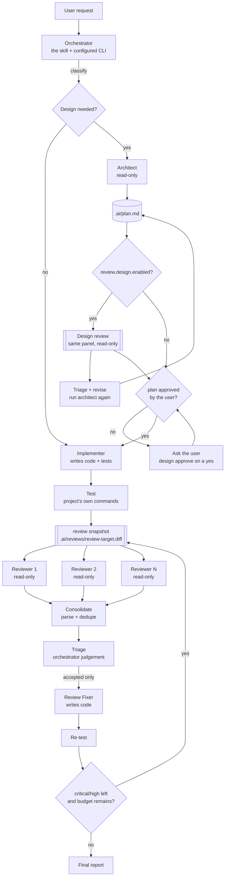

# Architecture

## The shape of the thing

The skill is **prompt-driven orchestration over a thin deterministic layer**.
Judgement stays in the model; mechanics stay in code.


```mermaid
flowchart TD
    U[User request] --> O[Orchestrator<br/>the skill + configured CLI]
    O -->|classify| D{Design needed?}
    D -->|no| I
    D -->|yes| A[Architect<br/>read-only]
    A --> P[(.ai/plan.md)]
    P --> DR{review.design.enabled?}
    DR -->|yes| DP[[Design review<br/>same panel, read-only]]
    DP --> DT[Triage + revise<br/>run architect again]
    DT --> P
    DR -->|no| AP{plan approved<br/>by the user?}
    DP --> AP
    AP -->|no| ASK[Ask the user<br/>design approve on a yes]
    ASK --> AP
    AP -->|yes| I[Implementer<br/>writes code + tests]
    I --> T[Test<br/>project's own commands]
    T --> S[[review snapshot<br/>.ai/reviews/review-target.diff]]
    S --> R1[Reviewer 1<br/>read-only]
    S --> R2[Reviewer 2<br/>read-only]
    S --> R3[Reviewer N<br/>read-only]
    R1 --> C[Consolidate<br/>parse + dedupe]
    R2 --> C
    R3 --> C
    C --> TR[Triage<br/>orchestrator judgement]
    TR -->|accepted only| F[Review Fixer<br/>writes code]
    F --> T2[Re-test]
    T2 --> Q{critical/high left<br/>and budget remains?}
    Q -->|yes| S
    Q -->|no| REP[Final report]
```

## Layers

| Layer | Lives in | Responsibility |
| --- | --- | --- |
| Skill | `skills/dev-orchestra/SKILL.md`, `references/` | What the orchestrator decides and when |
| CLI | `scripts/dev_orchestra.py`, `scripts/orchestrator/cli.py` (parser and entry point) and `cli_*.py` (one module per group of commands) | Deterministic operations an agent can call |
| Domain | `config.py`, `review_*.py` (re-exported by `review.py`), `workspace.py`, `wizard.py`, `doctor.py` | Config layering, snapshotting, parsing, dedupe, triage, diagnostics |
| Providers | `scripts/orchestrator/providers/` | The only code that knows CLI syntax and model names |

Nothing above the provider layer knows that `claude` uses `--model` and `codex`
uses `-m`. Nothing below the skill layer decides whether a design stage is
warranted.

## Why this split

**Judgement is not reproducible; plumbing must be.** Deduplicating findings,
freezing a diff, and layering config files give the same answer every time, so
they are code and they are tested. Deciding whether a finding is a real bug in
*this* codebase is exactly what a model is for, so it stays in the prompt.

**Reviews must be independent to be worth anything.** Three models that see each
other's output converge; three that don't, disagree usefully. So the fan-out is
code: same frozen snapshot, isolated processes, no shared context, read-only by
the CLI's own enforcement (tool allowlist and `--restricted` for Claude,
sandbox for Codex). It cannot be accidentally violated by a prompt that gets
edited.

**Models change faster than skills do.** Nothing persists a dated model id. The
config stores `family` + `version: latest`, and adapters resolve that against
whatever the installed CLI says today. An adapter that cannot verify a model
raises instead of guessing.

**Auth belongs to the CLIs.** The skill runs `claude` and `codex` as
subprocesses with the user's environment inherited, so existing subscriptions
and logins just work. The skill stores no credentials and reads none.

## Data flow

```
project/
├── .dev-orchestra.yaml         # optional per-project override
└── .ai/                          # working artifacts (self-ignoring)
    ├── plan.md                   # Architect output
    ├── execution/                # prompts you wrote, fix brief, role outputs
    ├── reviews/
    │   ├── review-target.diff    # the frozen snapshot every reviewer sees
    │   ├── review-target.json    # strategy, files, sha256
    │   ├── review-surrounding.json  # enclosing symbols, only with review.context.surrounding: enclosing
    │   ├── <reviewer-id>.md      # one report per reviewer
    │   ├── consolidated.md       # deduped findings, human readable
    │   ├── consolidated.json     # deduped findings + triage state
    │   ├── rounds/               # consolidated.json of every round, kept after the next
    │   └── design/               # the same files for the design review, so
    │                             # its rounds and triage stay its own
    └── state.json                # stage events with resolved model ids
```

`consolidated.json` is the hand-off between stages: `review run` writes it,
triage annotates it, `review fix-brief` reads it, `review status` decides
whether another round is warranted.

## Extension points

- **A new CLI**: one module in `providers/` plus one `register()` call -- or,
  without editing the plugin, one module in `<config dir>/providers/`, which
  is imported after the built-ins and survives plugin updates. See
  `references/providers.md`.
- **A new reviewer role**: any string works; built-in roles just get sharper
  prompt guidance (`ROLE_GUIDANCE` in `review_common.py`).
- **A different workspace location**: `workspace.dir` in the config.
- **A different review prompt**: `build_review_prompt` accepts a template.

## Security

- **Credentials are never requested, stored, or printed.** The skill inherits
  the user's environment and relies on the CLIs' existing authentication.
- `doctor` reports credential *presence* (`present` / `unknown`), never values.
- Captured stdout/stderr passes through a redactor that scrubs
  credential-shaped strings before anything is written to `.ai/` or shown
  (`references/providers.md`).
- The architect and reviewers run read-only, enforced by the CLI rather than
  the prompt. Claude: plan mode, only the `Read`, `Grep` and `Glob` tools, no
  MCP servers, and `--restricted`, so no shell, no hooks from the repository's
  settings files, and no reading outside the working directory and
  `--add-dir`. Codex: `-s read-only`, which stops writes; its MCP servers were
  not examined. `--restricted` also means the user's own `permissions.deny`
  rules do not apply to those Claude runs -- they belong in managed settings.
- Read-only runs refuse raw arguments that could loosen them: Claude accepts
  only `--add-dir <path>`, from the global config or `--extra` (never from the
  project file), and Codex accepts none. Refusals never print the value. See
  [Role options](configuration.md#role-options).
- Artifacts stay in `.ai/`, which ignores itself by default.

Security problems are reported privately, as `CONTRIBUTING.md` describes.

## Deliberate non-goals

- No daemon, no server, no state outside the project and the config file.
- No network access of its own; the CLIs do their own networking.
- No vendored model catalogue that has to be updated on a release cadence.
- No orchestration DSL — the pipeline is short enough to describe in prose.
